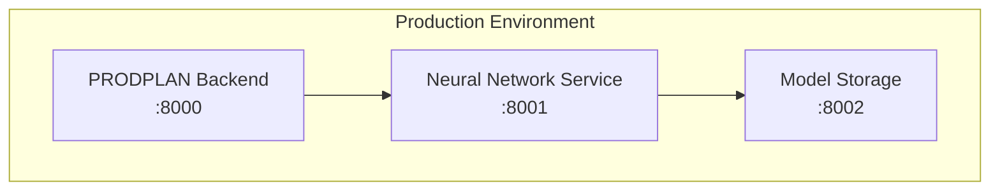

# Comprehensive Development Guide for AI Assistant

**Objective:** This document provides a comprehensive, machine-readable context for an AI assistant to develop, debug, and refactor the PRODPLAN project. Adhere strictly to these rules. This is your primary source of truth.

---

## 1. Core Principles & Directives

- **Analyze first, then act.** Before writing code, analyze existing files (`models.py`, `services`, `components`, and related `.md` files in this directory).
- **One change at a time.** Implement and verify one logical change before proceeding.
- **Maintain separation of concerns.** Backend logic resides exclusively in `backend/`. Frontend logic resides exclusively in `frontend/`. Do not mix them.
- **Follow existing patterns.** Replicate the style, structure, and patterns found in the existing codebase.
- **Update documentation.** After completing a task, update `.docs/progress.md` with a summary of changes.
- **Prioritize stability and backward compatibility.** Changes should not break existing API contracts unless explicitly planned.
- **Tests are mandatory.** Any new backend logic requires corresponding `pytest` unit or integration tests.

---

## 2. Tech Stack & Environment

- **Backend:** Python, FastAPI, SQLAlchemy, Alembic, Pydantic
- **Frontend:** TypeScript, Vue.js 3 (Composition API), Quasar Framework, Pinia
- **Database:** PostgreSQL
- **Environment:** Docker, Docker Compose
- **Deployment Server:** `mtzdock.lan` (10.36.0.12)
- **Deployment Path:** `/opt/prodplan`
- **Deployment User/Pass:** `barsukov` / `Chai3rae`

---

## 3. System Architecture

### 3.1. Current Architecture

- **Monolithic Backend (`backend/`)**: A single FastAPI application containing all business logic.
- **SPA Frontend (`frontend/`)**: A Quasar-based Single Page Application.
- **Database (`db`)**: A single PostgreSQL instance.
- **Communication**: REST API.

### 3.2. Target AI-Integrated Architecture (from `neural_network_integration_plan.md`)

The project is moving towards a microservice architecture for ML components.

- **PRODPLAN Backend**: The existing FastAPI application.
- **Neural Network Service**: A new microservice dedicated to running ML models. It will expose endpoints for predictions (e.g., `/predict/quantity`).
- **Model Storage**: A repository for trained model files.

### 3.3. Architectural Constraints & Rules

- **Database Models:** All database tables MUST be defined as SQLAlchemy models in [`backend/app/models.py`](backend/app/models.py:1).
- **Database Migrations:** Any change to `models.py` REQUIRES a new Alembic migration. Use `docker-compose exec backend alembic revision --autogenerate -m "description"` to create it.
- **API Schemas:** All API request/response bodies MUST be defined as Pydantic models in [`backend/app/schemas.py`](backend/app/schemas.py:1).
- **Business Logic:** All core business logic MUST be placed in the `backend/app/services/` directory. Routers in `backend/app/routers/` should only handle HTTP transport layer, validation, and calls to services.
- **Frontend State Management:** Global state is managed by Pinia stores in `frontend/src/stores/`.
- **Frontend API-Client:** All backend API calls MUST be made through the `frontend/src/services/api.ts` client.

---

## 4. Business Logic & MRP Process Context

*(Extracted from `order_calculation_module_report.md` and `mrp_demand_refactor_plan.md`)*

### 4.1. MRP Calculation Flow

1.  **Load Config**: Load active configuration from `PlanningConfigVersion`.
2.  **Load Inputs**: Load MPS (Master Production Schedule), BOMs, Stock, WIP (Work In Progress).
3.  **Calculate Gross Requirements**:
    -   Perform BOM explosion for each MPS entry.
    -   **IMPORTANT RULE CHANGE**: The old `daily/weekly` logic is deprecated. Calculation is now based on actual days present in the plan. The `dcontig` heuristic is no longer used.
    -   **Buffer Rule**: The `need_date` of a child component is shifted earlier by the parent's buffer days: `need_date(child) = need_date(parent) - buffer_days(parent)`. This is a key change from `mrp_demand_refactor_plan.md`.
4.  **Calculate Net Requirements**: `Net = Gross - Stock - WIP`. The `include_wip` toggle from the config must be respected.
5.  **Classify Flow**: Determine if an item is "Production" or "Purchase" based on its replenishment method.
6.  **Create Orders**:
    -   **Purchases**: Apply lead time, MOQ, and lot-sizing rules.
    -   **Production**: Use `OrderQuantityCalculator` which prioritizes: 1) Optimal Batch, 2) Buffer Quantity, 3) Standard lot-sizing.
7.  **Schedule Capacity**: Use `CapacityScheduler` to perform backward scheduling based on resource availability and calendars.
8.  **Build Pegging**: Use `PeggingBuilder` to create `PeggingLink` records for traceability.
9.  **Prioritize**: Use `PriorityManager` to calculate order priority based on criticality, importance, and cycle time.

### 4.2. Date Filtering Logic (from `date_filtering_changes.md`)

-   **DEPRECATED**: Filtering by `bucket_date` and the concept of `day_date` (Задание на день) are removed.
-   **CURRENT**: All date filtering in APIs and UI MUST use `start_date`.
-   The endpoint `GET /api/v1/plan/results/{run_id}/production/agenda_day` is **DELETED**.

---

## 5. Configuration Dictionary (from `planning_config_schema.json`)

This is the dictionary of all valid MRP configuration parameters.

| Path | Type | Default | Description |
|---|---|---|---|
| `planning_horizon_days` | number | 90 | Horizon for the entire plan calculation. |
| `mps_daily_horizon_days`| number | 90 | Horizon for detailed MPS planning. |
| `weekly.enabled` | boolean| true | **DEPRECATED**. Do not use in core logic. For reporting only. |
| `procurement.default_lead_time_days` | number | 30 | Default lead time for purchased items. |
| `procurement.lot_sizing`| object | | MOQ, multiple, and rounding rules for purchases. |
| `production.lot_sizing` | object | | Min batch, multiple, and rounding for production. |
| `safety_stock_percent` | number | 1 | Safety stock as a percentage of demand. |
| `capacity.use_resource_calendars`| boolean| true | Whether to consider resource availability calendars. |
| `prioritization.weight_*`| number | | Weights for criticality, importance, cycle time in priority calculation. |
| `toggles.include_wip` | boolean| false | If true, WIP is subtracted when calculating net requirements. **MUST be respected.** |

---

## 6. Key Commands & Deployment

*(Extracted from `prodplan-deploy.md` and `04-admin-guide.md`)*

### 6.1. Local Development

- **Start all services:** `start.bat` (Windows) or `./start.sh` (Unix)
- **Rebuild Docker images:** `rebuild.bat`
- **Stop all services:** `docker-compose down`
- **View logs:** `docker-compose logs -f [service_name]`
- **Run backend tests:** `docker-compose exec backend pytest`

### 6.2. Production Deployment on `mtzdock.lan`

- **Connect:** `ssh barsukov@mtzdock.lan` (Pass: `Chai3rae`)
- **Navigate:** `cd /opt/prodplan`
- **Full Update Sequence:**
  1.  `docker-compose down`
  2.  `git pull origin main`
  3.  `docker-compose build --no-cache`
  4.  `docker-compose up -d`
  5.  `docker-compose ps` (to verify)
- **Database Backup:** `docker-compose exec -T db pg_dump -U prodplan -d prodplan > backup.sql`
- **Database Restore:** `cat backup.sql | docker-compose exec -T db psql -U prodplan -d prodplan`

---

## 7. Strategic Roadmap & Backlog Context

*(Extracted from `05-roadmap.md` and `prodplan_development_roadmap.md`)*

- **Immediate Priority (Q1 2025):** Stability and optimization.
  -   Refactor monolithic services like `planning_service.py` into smaller, dedicated services.
  -   Increase test coverage to 80%.
  -   Implement CI/CD pipeline.
  -   Set up monitoring with Prometheus/Grafana.
- **Mid-Term Priority (Q2-Q4 2025):** Functional expansion.
  -   Advanced MRP (demand forecasting).
  -   Improved supplier management.
  -   Major UI/UX redesign with a focus on interactivity (e.g., Drag & Drop).
- **Long-Term Priority (2026-2027):** Enterprise features and AI.
  -   Transition to a full microservice architecture (Kubernetes).
  -   Implement advanced ML models (see `neural_network_integration_plan.md`).
  -   Develop multi-tenancy and advanced security (SSO, RBAC).
  -   Integrate Generative AI for recommendations and natural language queries.

---
**End of Guide.**