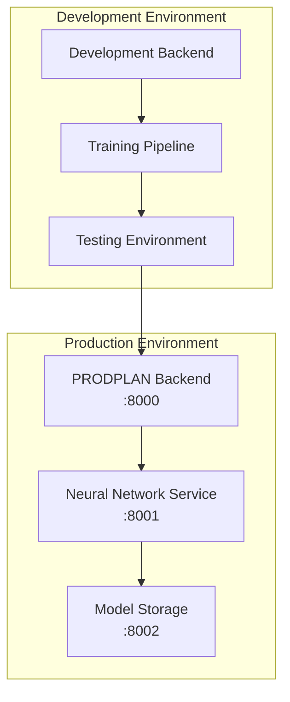

# Технические рекомендации по интеграции нейросети в систему PRODPLAN

**Версия:** 1.0  
**Дата:** 2025-11-10  
**Статус:** Готово к реализации

## Исполнительное резюме

Настоящий документ содержит детальные технические рекомендации по интеграции нейросетевых технологий в существующую систему планирования производства PRODPLAN. Интеграция направлена на улучшение точности расчётов, автоматизацию принятия решений и повышение адаптивности системы к изменениям производственной среды.

## 1. Анализ текущей архитектуры

### 1.1 Ключевые компоненты системы

| Компонент | Назначение | Нагрузка | Точка интеграции |
|-----------|------------|----------|------------------|
| **OrderQuantityCalculator** | Расчёт количеств заказов с учётом буферов и оптимальных партий | Высокая | **Приоритет 1** |
| **CapacityScheduler** | Календарное планирование мощностей | Средняя | **Приоритет 2** |
| **PriorityManager** | Управление приоритетами заказов | Низкая | **Приоритет 3** |
| **PlanningService** | Координация MRP процесса | Высокая | **Приоритет 1** |

### 1.2 Поэтапный MRP процесс

```
MPS (Главный план) → Валовые требования → Нетто требования → 
Расчёт количеств → Создание заказов → Календарное планирование
     ↑              ↑                   ↑              ↑             ↑                ↑
  1️⃣            2️⃣                 3️⃣           4️⃣          5️⃣              6️⃣
```

**Нейросетевые точки интеграции:**
- **Этап 4️⃣**: Оптимизация размеров партий
- **Этап 6️⃣**: Интеллектуальное распределение ресурсов

## 2. Архитектурное решение интеграции

### 2.1 Микросервисная архитектура



### 2.2 Компоненты нейросетевого модуля

#### 2.2.1 Neural Network Service (`backend/app/services/neural_network_service.py`)

```python
class NeuralNetworkService:
    """
    Центральный сервис для интеграции нейросетевых моделей
    """
    
    def __init__(self, model_path: str, config: dict):
        self.model_path = model_path
        self.config = config
        self.model_registry = ModelRegistry()
        
    async def predict_order_quantity(
        self, 
        context: OrderContext,
        fallback_classical: bool = True
    ) -> QuantityPrediction:
        """
        Предсказание оптимального количества заказа
        """
        try:
            # Проверка готовности модели
            if not self.model_registry.is_model_ready('quantity_prediction'):
                if fallback_classical:
                    return self._fallback_to_classical(context)
                raise ModelNotReadyError()
            
            # Инференс
            features = self._extract_features(context)
            prediction = await self._inference('quantity_prediction', features)
            
            # Валидация результата
            if self._validate_prediction(prediction):
                return prediction
            elif fallback_classical:
                return self._fallback_to_classical(context)
            
        except Exception as e:
            self.logger.error(f"NN prediction failed: {e}")
            if fallback_classical:
                return self._fallback_to_classical(context)
            raise
            
    async def optimize_capacity_schedule(
        self, 
        demand: List[DemandRequirement],
        capacity: List[ResourceCapacity]
    ) -> ScheduleOptimization:
        """
        Оптимизация календарного плана
        """
        pass
        
    async def calculate_priority_score(
        self, 
        order: ProductionOrder,
        context: PlanningContext
    ) -> PriorityScore:
        """
        Расчёт приоритета с использованием ML
        """
        pass
```

#### 2.2.2 Model Manager (`backend/app/services/model_manager.py`)

```python
class ModelManager:
    """
    Управление моделями и их жизненным циклом
    """
    
    def __init__(self):
        self.models = {}
        self.model_configs = {}
        self.performance_metrics = {}
        
    async def load_model(self, model_id: str, model_path: str) -> None:
        """
        Загрузка модели в память
        """
        try:
            model = self._load_model_from_path(model_path)
            self.models[model_id] = model
            self.performance_metrics[model_id] = PerformanceTracker()
            self.logger.info(f"Model {model_id} loaded successfully")
        except Exception as e:
            self.logger.error(f"Failed to load model {model_id}: {e}")
            raise
            
    async def get_model_prediction(
        self, 
        model_id: str, 
        features: Dict[str, Any]
    ) -> Dict[str, Any]:
        """
        Получение предсказания от модели
        """
        if model_id not in self.models:
            raise ModelNotLoadedError(f"Model {model_id} not loaded")
            
        model = self.models[model_id]
        return await self._predict_with_model(model, features)
        
    async def update_model_performance(
        self, 
        model_id: str, 
        metrics: ModelMetrics
    ) -> None:
        """
        Обновление метрик модели
        """
        self.performance_metrics[model_id].update(metrics)
        
        # Проверка необходимости переобучения
        if metrics.accuracy < self.model_configs[model_id].min_accuracy:
            await self._trigger_retraining(model_id)
```

### 2.3 Интеграция с существующими компонентами

#### 2.3.1 OrderQuantityCalculator + Neural Network

```python
# backend/app/services/order_quantity_calculator.py (модификация)

class OrderQuantityCalculator:
    def __init__(self, /* ... */, neural_network_service: NeuralNetworkService = None):
        # ... существующий код ...
        self.neural_network = neural_network_service
        
    def compute(self, item_id: int, requested_qty: float) -> Tuple[float, float, Dict[str, Any], List[Dict[str, Any]]]:
        # ... существующая логика ...
        
        # Интеграция нейросети для оптимизации
        if self.neural_network and self._should_use_neural_network(item_id, requested_qty):
            try:
                nn_prediction = self.neural_network.predict_order_quantity(
                    context=OrderContext(item_id, requested_qty, self._get_context()),
                    fallback_classical=True
                )
                
                if nn_prediction.confidence > 0.8:
                    # Используем нейросетевое предсказание
                    final_qty = nn_prediction.predicted_quantity
                    computation_details["nn_prediction"] = {
                        "confidence": nn_prediction.confidence,
                        "method": "neural_network"
                    }
            except Exception as e:
                self.logger.warning(f"Neural network prediction failed, using classical method: {e}")
        
        return float(final_qty), float(normalized_qty), computation_details, warnings
        
    def _should_use_neural_network(self, item_id: int, quantity: float) -> bool:
        """
        Определяет, следует ли использовать нейросетевое предсказание
        """
        # Критерии использования NN:
        # 1. Товар имеет достаточно исторических данных
        # 2. Количество превышает определённый порог
        # 3. Модель готова и прошла валидацию
        
        min_historical_orders = 50
        min_quantity_threshold = 100.0
        
        return (
            self._has_sufficient_history(item_id) and
            quantity >= min_quantity_threshold and
            self.neural_network and
            self.neural_network.is_model_ready('quantity_prediction')
        )
```

## 3. Требования к данным и обучению

### 3.1 Структура данных

#### 3.1.1 Обучающие данные для расчёта партий

```json
{
  "features": {
    "item_id": "integer",
    "requested_quantity": "float",
    "current_stock": "float",
    "wip_quantity": "float",
    "lead_time_days": "integer",
    "buffer_days": "integer",
    "optimal_batch": "float",
    "daily_demand_avg": "float",
    "daily_demand_std": "float",
    "seasonality_factor": "float",
    "supplier_reliability": "float",
    "production_capacity_utilization": "float"
  },
  "target": "optimal_order_quantity",
  "context": {
    "timestamp": "datetime",
    "horizon_days": "integer",
    "production_kind": "string",
    "area_buffer_days": "integer"
  }
}
```

#### 3.1.2 Данные для оптимизации ресурсов

```json
{
  "features": {
    "resource_id": "integer",
    "total_demand_hours": "float",
    "available_hours": "float",
    "current_utilization": "float",
    "setup_time": "float",
    "production_kind": "string",
    "weekday": "integer",
    "seasonality": "float",
    "efficiency_trend": "float",
    "maintenance_scheduled": "boolean"
  },
  "target": {
    "scheduled_hours": "float",
    "overload_risk": "float",
    "efficiency_score": "float"
  }
}
```

### 3.2 Подготовка данных

```python
# backend/app/services/data_preparation.py

class DataPreparationService:
    """
    Подготовка данных для обучения моделей
    """
    
    def __init__(self, db_session: Session):
        self.db = db_session
        
    async def prepare_quantity_data(self, days_back: int = 365) -> pd.DataFrame:
        """
        Подготовка данных для модели расчёта партий
        """
        # Сбор исторических данных
        query = """
        SELECT 
            i.item_id,
            po.qty as requested_qty,
            i.stock_qty as current_stock,
            po.need_date,
            s.production_kind_id,
            pr.buffer_days,
            i.optimal_batch,
            -- Дополнительные фичи
        FROM planned_order po
        JOIN items i ON po.item_id = i.item_id
        LEFT JOIN default_specification ds ON i.item_id = ds.item_id
        LEFT JOIN specifications s ON ds.spec_id = s.spec_id
        LEFT JOIN production_kinds pk ON s.production_kind_id = pk.id
        LEFT JOIN resource_production_kinds rpk ON pk.id = rpk.production_kind_id
        LEFT JOIN production_resources pr ON rpk.resource_id = pr.resource_id
        WHERE po.need_date >= CURRENT_DATE - INTERVAL '%s days'
        """
        
        data = pd.read_sql(query % days_back, self.db.bind)
        
        # Создание агрегированных фич
        data = await self._create_aggregated_features(data)
        data = await self._encode_categorical_features(data)
        data = await self._handle_missing_values(data)
        
        return data
        
    async def _create_aggregated_features(self, df: pd.DataFrame) -> pd.DataFrame:
        """
        Создание агрегированных признаков
        """
        # Среднедневной спрос за последние 30 дней
        daily_demand = df.groupby('item_id')['requested_qty'].rolling(30).mean().reset_index()
        daily_demand.columns = ['item_id', 'idx', 'daily_demand_avg']
        df = df.merge(daily_demand, left_index=True, right_on='idx', how='left')
        
        # Стандартное отклонение спроса
        demand_std = df.groupby('item_id')['requested_qty'].rolling(30).std().reset_index()
        demand_std.columns = ['item_id', 'idx', 'daily_demand_std']
        df = df.merge(demand_std, left_index=True, right_on='idx', how='left')
        
        return df
```

### 3.3 Архитектура моделей

#### 3.3.1 Модель для расчёта партий

```python
# model/quantity_prediction_model.py

import torch
import torch.nn as nn
from torch.utils.data import DataLoader, TensorDataset

class QuantityPredictionModel(nn.Module):
    """
    Нейросеть для предсказания оптимального количества заказа
    """
    
    def __init__(self, input_size: int, hidden_sizes: List[int] = [256, 128, 64]):
        super().__init__()
        
        layers = []
        prev_size = input_size
        
        for hidden_size in hidden_sizes:
            layers.extend([
                nn.Linear(prev_size, hidden_size),
                nn.ReLU(),
                nn.Dropout(0.2),
                nn.BatchNorm1d(hidden_size)
            ])
            prev_size = hidden_size
            
        layers.append(nn.Linear(prev_size, 1))
        
        self.network = nn.Sequential(*layers)
        
    def forward(self, x):
        return self.network(x)
        
class QuantityPredictionTrainer:
    def __init__(self, model: QuantityPredictionModel, device: str = 'cpu'):
        self.model = model.to(device)
        self.device = device
        self.criterion = nn.MSELoss()
        self.optimizer = torch.optim.Adam(self.model.parameters(), lr=0.001)
        self.scheduler = torch.optim.lr_scheduler.ReduceLROnPlateau(
            self.optimizer, patience=10, factor=0.5
        )
        
    def train_epoch(self, train_loader: DataLoader) -> float:
        self.model.train()
        total_loss = 0
        
        for batch_x, batch_y in train_loader:
            batch_x, batch_y = batch_x.to(self.device), batch_y.to(self.device)
            
            self.optimizer.zero_grad()
            outputs = self.model(batch_x).squeeze()
            loss = self.criterion(outputs, batch_y)
            loss.backward()
            
            # Gradient clipping
            torch.nn.utils.clip_grad_norm_(self.model.parameters(), max_norm=1.0)
            
            self.optimizer.step()
            total_loss += loss.item()
            
        return total_loss / len(train_loader)
```

## 4. Интеграция с FastAPI

### 4.1 Новые API эндпоинты

```python
# backend/app/routers/neural_network.py

from fastapi import APIRouter, Depends, HTTPException
from typing import Dict, Any, List
from ..services.neural_network_service import NeuralNetworkService
from ..services.model_manager import ModelManager
from pydantic import BaseModel

router = APIRouter(prefix="/v1/ml", tags=["machine-learning"])

class QuantityPredictionRequest(BaseModel):
    item_id: int
    requested_qty: float
    context: Dict[str, Any]

class QuantityPredictionResponse(BaseModel):
    predicted_quantity: float
    confidence: float
    method: str
    processing_time_ms: float
    fallback_used: bool

class ModelInfo(BaseModel):
    model_id: str
    status: str
    accuracy: float
    last_updated: str
    version: str

@router.post("/quantity/predict", response_model=QuantityPredictionResponse)
async def predict_quantity(
    request: QuantityPredictionRequest,
    nn_service: NeuralNetworkService = Depends(get_neural_network_service)
):
    """
    Предсказание оптимального количества заказа с использованием ML
    """
    try:
        context = OrderContext(
            item_id=request.item_id,
            requested_qty=request.requested_qty,
            additional_context=request.context
        )
        
        prediction = await nn_service.predict_order_quantity(
            context=context,
            fallback_classical=True
        )
        
        return QuantityPredictionResponse(
            predicted_quantity=prediction.predicted_quantity,
            confidence=prediction.confidence,
            method=prediction.method,
            processing_time_ms=prediction.processing_time_ms,
            fallback_used=prediction.fallback_used
        )
        
    except Exception as e:
        raise HTTPException(status_code=500, detail=f"ML prediction failed: {str(e)}")

@router.get("/models/status", response_model=List[ModelInfo])
async def get_models_status(
    model_manager: ModelManager = Depends(get_model_manager)
):
    """
    Получение статуса всех загруженных моделей
    """
    return await model_manager.get_all_models_status()

@router.post("/models/retrain/{model_id}")
async def retrain_model(
    model_id: str,
    model_manager: ModelManager = Depends(get_model_manager)
):
    """
    Запуск переобучения модели
    """
    try:
        task_id = await model_manager.trigger_retraining(model_id)
        return {"status": "retraining_started", "task_id": task_id}
    except Exception as e:
        raise HTTPException(status_code=500, detail=f"Retraining failed: {str(e)}")

@router.get("/models/performance/{model_id}")
async def get_model_performance(
    model_id: str,
    model_manager: ModelManager = Depends(get_model_manager)
):
    """
    Получение метрик производительности модели
    """
    try:
        metrics = await model_manager.get_performance_metrics(model_id)
        return metrics
    except Exception as e:
        raise HTTPException(status_code=500, detail=f"Failed to get metrics: {str(e)}")
```

### 4.2 Конфигурация сервиса

```python
# backend/app/main.py (добавление)

from .services.neural_network_service import NeuralNetworkService
from .services.model_manager import ModelManager

# Инициализация сервисов ML
ml_model_manager = ModelManager()
ml_service = NeuralNetworkService(
    model_path="./models/",
    config={
        "models": {
            "quantity_prediction": {
                "enabled": True,
                "model_path": "./models/quantity_prediction/",
                "min_confidence": 0.8,
                "fallback_enabled": True
            },
            "capacity_optimization": {
                "enabled": True,
                "model_path": "./models/capacity_optimization/",
                "min_confidence": 0.75,
                "fallback_enabled": True
            }
        }
    }
)

# Регистрация в приложении
app.state.ml_service = ml_service
app.state.ml_model_manager = ml_model_manager

# Подключение роутеров
app.include_router(neural_network_router, prefix="/v1/ml")
```

## 5. Обратная совместимость с Vue.js Frontend

### 5.1 Адаптация API

```typescript
// frontend/src/services/mlApi.ts

import { api } from './api'

export interface QuantityPredictionRequest {
  item_id: number
  requested_qty: number
  context: {
    current_stock?: number
    buffer_days?: number
    optimal_batch?: number
  }
}

export interface QuantityPredictionResponse {
  predicted_quantity: number
  confidence: number
  method: 'neural_network' | 'classical'
  processing_time_ms: number
  fallback_used: boolean
}

export interface MLModelInfo {
  model_id: string
  status: 'loading' | 'ready' | 'error' | 'retraining'
  accuracy: number
  last_updated: string
  version: string
}

export const mlApi = {
  async predictQuantity(request: QuantityPredictionRequest): Promise<QuantityPredictionResponse> {
    const response = await api.post('/ml/quantity/predict', request)
    return response.data
  },

  async getModelsStatus(): Promise<MLModelInfo[]> {
    const response = await api.get('/ml/models/status')
    return response.data
  },

  async getModelPerformance(modelId: string) {
    const response = await api.get(`/ml/models/performance/${modelId}`)
    return response.data
  },

  async retrainModel(modelId: string) {
    const response = await api.post(`/ml/models/retrain/${modelId}`)
    return response.data
  }
}
```

### 5.2 Компоненты Vue.js

```vue
<!-- frontend/src/components/ml/MLPredictionIndicator.vue -->
<template>
  <div class="ml-prediction-indicator" :class="statusClass">
    <q-icon :name="iconName" size="sm" class="q-mr-sm" />
    <span class="text-caption">
      {{ indicatorText }}
    </span>
    <q-tooltip v-if="tooltipText">
      {{ tooltipText }}
    </q-tooltip>
  </div>
</template>

<script setup lang="ts">
import { computed } from 'vue'
import { useMLStore } from 'src/stores/mlStore'

interface Props {
  method: 'neural_network' | 'classical'
  confidence?: number
  fallbackUsed?: boolean
}

const props = defineProps<Props>()

const mlStore = useMLStore()

const statusClass = computed(() => ({
  'bg-green-1 text-green-8': props.method === 'neural_network' && props.fallbackUsed === false,
  'bg-blue-1 text-blue-8': props.method === 'neural_network' && props.fallbackUsed === true,
  'bg-grey-2 text-grey-8': props.method === 'classical'
}))

const iconName = computed(() => {
  if (props.method === 'neural_network') {
    return props.fallbackUsed ? 'psychology' : 'auto_awesome'
  }
  return 'calculate'
})

const indicatorText = computed(() => {
  if (props.method === 'neural_network') {
    return props.fallbackUsed 
      ? 'ML с резервным алгоритмом'
      : 'ML предсказание'
  }
  return 'Классический расчёт'
})

const tooltipText = computed(() => {
  if (props.method === 'neural_network' && props.confidence) {
    return `Уверенность модели: ${(props.confidence * 100).toFixed(1)}%`
  }
  return null
})
</script>

<style scoped>
.ml-prediction-indicator {
  display: inline-flex;
  align-items: center;
  padding: 4px 8px;
  border-radius: 4px;
  font-size: 12px;
}
</style>
```

### 5.3 Интеграция в существующие страницы

```vue
<!-- frontend/src/pages/MRPRunsPage.vue (модификация) -->
<template>
  <q-page class="q-pa-md">
    <div class="row q-gutter-md">
      <div class="col-12">
        <q-card>
          <q-card-section>
            <div class="text-h6">MRP Планирование</div>
            <div class="text-subtitle2">Результаты расчёта заказов</div>
          </q-card-section>
          
          <q-card-section>
            <!-- ML Status Panel -->
            <MLStatusPanel v-if="mlEnabled" />
            
            <!-- Existing results table -->
            <ProductionOrdersTable 
              :rows="productionOrders"
              :columns="columns"
              @row-click="onRowClick"
            />
          </q-card-section>
        </q-card>
      </div>
    </div>
  </q-page>
</template>

<script setup lang="ts">
import { ref, onMounted } from 'vue'
import { mlApi } from 'src/services/mlApi'
import MLStatusPanel from 'src/components/ml/MLStatusPanel.vue'
import ProductionOrdersTable from 'src/components/mrp/ProductionOrdersTable.vue'

const mlEnabled = ref(true)
const productionOrders = ref([])

const columns = [
  // ... existing columns ...
  {
    name: 'ml_prediction',
    label: 'ML',
    field: 'ml_prediction',
    format: (val: any) => h(MLPredictionIndicator, {
      method: val.method,
      confidence: val.confidence,
      fallbackUsed: val.fallbackUsed
    })
  }
]

// Load data with ML enhancement
const loadData = async () => {
  try {
    // Get base MRP results
    const mrpResults = await fetchMRPResults()
    
    // Enhance with ML predictions if models are ready
    const modelsStatus = await mlApi.getModelsStatus()
    const quantityModelReady = modelsStatus.find(m => m.model_id === 'quantity_prediction')?.status === 'ready'
    
    if (quantityModelReady && mrpResults.orders) {
      // Enhance each order with ML prediction
      for (const order of mrpResults.orders) {
        try {
          const mlPrediction = await mlApi.predictQuantity({
            item_id: order.item_id,
            requested_qty: order.qty,
            context: {
              current_stock: order.current_stock,
              buffer_days: order.buffer_days,
              optimal_batch: order.optimal_batch
            }
          })
          
          order.ml_prediction = {
            method: mlPrediction.method,
            confidence: mlPrediction.confidence,
            fallbackUsed: mlPrediction.fallback_used,
            predicted_quantity: mlPrediction.predicted_quantity
          }
        } catch (error) {
          console.warn('ML prediction failed for order', order.order_id, error)
        }
      }
    }
    
    productionOrders.value = mrpResults.orders || []
  } catch (error) {
    console.error('Failed to load data:', error)
  }
}
</script>
```

## 6. Система мониторинга и валидации

### 6.1 Мониторинг производительности моделей

```python
# backend/app/services/model_monitoring.py

import logging
import time
from typing import Dict, Any, List
from dataclasses import dataclass
from datetime import datetime, timedelta

@dataclass
class ModelMetrics:
    accuracy: float
    precision: float
    recall: float
    f1_score: float
    mae: float  # Mean Absolute Error
    rmse: float  # Root Mean Square Error
    prediction_count: int
    error_count: int
    avg_inference_time_ms: float
    timestamp: datetime

class ModelMonitoringService:
    """
    Сервис мониторинга производительности ML моделей
    """
    
    def __init__(self, db_session: Session):
        self.db = db_session
        self.logger = logging.getLogger(__name__)
        self.metrics_cache = {}
        self.alert_thresholds = {
            'min_accuracy': 0.75,
            'max_inference_time': 1000,  # ms
            'min_prediction_rate': 0.8,
            'max_error_rate': 0.05
        }
        
    async def track_prediction(
        self, 
        model_id: str, 
        features: Dict[str, Any], 
        prediction: Any, 
        actual: Any = None,
        inference_time_ms: float = 0
    ) -> None:
        """
        Отслеживание отдельного предсказания
        """
        # Сохранение в кэше для агрегации
        if model_id not in self.metrics_cache:
            self.metrics_cache[model_id] = []
            
        self.metrics_cache[model_id].append({
            'features': features,
            'prediction': prediction,
            'actual': actual,
            'timestamp': datetime.utcnow(),
            'inference_time_ms': inference_time_ms,
            'error': abs(prediction - actual) if actual is not None else None
        })
        
        # Ограничение размера кэша
        if len(self.metrics_cache[model_id]) > 10000:
            self.metrics_cache[model_id] = self.metrics_cache[model_id][-5000:]
            
        # Проверка критических метрик в реальном времени
        await self._check_real_time_alerts(model_id)
        
    async def calculate_metrics(
        self, 
        model_id: str, 
        time_window_hours: int = 24
    ) -> ModelMetrics:
        """
        Расчёт метрик за определённый период
        """
        cutoff_time = datetime.utcnow() - timedelta(hours=time_window_hours)
        
        # Получение предсказаний за период
        query = """
        SELECT prediction, actual, inference_time_ms, error
        FROM model_predictions 
        WHERE model_id = ? AND timestamp >= ?
        ORDER BY timestamp DESC
        """
        
        # Выполнение запроса (упрощено)
        results = self.db.execute(query, model_id, cutoff_time).fetchall()
        
        if not results:
            return ModelMetrics(
                accuracy=0, precision=0, recall=0, f1_score=0,
                mae=0, rmse=0, prediction_count=0, error_count=0,
                avg_inference_time_ms=0, timestamp=datetime.utcnow()
            )
        
        # Расчёт метрик
        predictions = [r[0] for r in results]
        actuals = [r[1] for r in results if r[1] is not None]
        inference_times = [r[2] for r in results if r[2] is not None]
        errors = [r[3] for r in results if r[3] is not None]
        
        # Базовые метрики
        prediction_count = len(predictions)
        error_count = len([e for e in errors if e is not None and e > 0])
        
        # Ошибки
        mae = sum(errors) / len(errors) if errors else 0
        rmse = (sum(e**2 for e in errors) / len(errors))**0.5 if errors else 0
        
        # Точность (для регрессии используем MAE)
        accuracy = max(0, 1 - (mae / max(predictions))) if predictions else 0
        
        return ModelMetrics(
            accuracy=accuracy,
            precision=0,  # Для регрессии не применимо
            recall=0,     # Для регрессии не применимо
            f1_score=0,   # Для регрессии не применимо
            mae=mae,
            rmse=rmse,
            prediction_count=prediction_count,
            error_count=error_count,
            avg_inference_time_ms=sum(inference_times) / len(inference_times) if inference_times else 0,
            timestamp=datetime.utcnow()
        )
        
    async def _check_real_time_alerts(self, model_id: str) -> None:
        """
        Проверка алертов в реальном времени
        """
        recent_metrics = await self.calculate_metrics(model_id, time_window_hours=1)
        
        alerts = []
        
        if recent_metrics.accuracy < self.alert_thresholds['min_accuracy']:
            alerts.append(f"Low accuracy: {recent_metrics.accuracy:.3f} < {self.alert_thresholds['min_accuracy']}")
            
        if recent_metrics.avg_inference_time_ms > self.alert_thresholds['max_inference_time']:
            alerts.append(f"High inference time: {recent_metrics.avg_inference_time_ms:.1f}ms > {self.alert_thresholds['max_inference_time']}ms")
            
        error_rate = recent_metrics.error_count / max(1, recent_metrics.prediction_count)
        if error_rate > self.alert_thresholds['max_error_rate']:
            alerts.append(f"High error rate: {error_rate:.3f} > {self.alert_thresholds['max_error_rate']}")
            
        if alerts:
            await self._send_alerts(model_id, alerts)
            
    async def _send_alerts(self, model_id: str, alerts: List[str]) -> None:
        """
        Отправка алертов при проблемах с моделью
        """
        alert_message = f"ML Model Alert - {model_id}:\n" + "\n".join(f"• {alert}" for alert in alerts)
        
        # Логирование
        self.logger.warning(alert_message)
        
        # Отправка в систему уведомлений (Slack, email, etc.)
        # await notification_service.send_alert(alert_message)
```

### 6.2 Валидация входящих данных

```python
# backend/app/services/data_validation.py

from typing import Dict, Any, List, Optional
from pydantic import BaseModel, validator
import numpy as np

class OrderContextValidator(BaseModel):
    """
    Валидация контекста для ML предсказаний
    """
    item_id: int
    requested_qty: float
    current_stock: float
    wip_quantity: float
    lead_time_days: int
    buffer_days: int
    optimal_batch: Optional[float] = None
    daily_demand_avg: float
    daily_demand_std: float
    
    @validator('requested_qty', 'current_stock', 'wip_quantity', 'daily_demand_avg', 'daily_demand_std')
    def check_positive(cls, v):
        if v < 0:
            raise ValueError('Value must be non-negative')
        return v
        
    @validator('lead_time_days', 'buffer_days')
    def check_positive_int(cls, v):
        if v < 0:
            raise ValueError('Days must be non-negative')
        return v
        
    @validator('optimal_batch')
    def check_optimal_batch(cls, v):
        if v is not None and v <= 0:
            raise ValueError('Optimal batch must be positive')
        return v
        
    def get_outliers(self) -> List[str]:
        """
        Определение выбросов в данных
        """
        outliers = []
        
        # Проверка завышенного спроса
        if self.requested_qty > self.daily_demand_avg * 30:
            outliers.append("Requested quantity is 30x average daily demand")
            
        # Проверка отрицательных остатков
        if self.current_stock < 0:
            outliers.append("Negative stock detected")
            
        # Проверка разумности buffer_days
        if self.buffer_days > 90:
            outliers.append("Buffer days exceeds 90 days")
            
        return outliers
        
    def is_valid_for_ml(self) -> bool:
        """
        Проверка пригодности данных для ML модели
        """
        # Проверка наличия достаточных исторических данных
        if self.daily_demand_avg < 1:
            return False
            
        # Проверка стабильности спроса (коэффициент вариации)
        cv = self.daily_demand_std / max(1e-10, self.daily_demand_avg)
        if cv > 5:  # Очень высокая вариативность
            return False
            
        # Проверка выбросов
        outliers = self.get_outliers()
        return len(outliers) == 0

class FeatureExtractor:
    """
    Извлечение признаков для ML моделей
    """
    
    @staticmethod
    def extract_quantity_features(context: OrderContextValidator) -> Dict[str, float]:
        """
        Извлечение признаков для модели предсказания количества
        """
        return {
            'requested_quantity': context.requested_qty,
            'current_stock': context.current_stock,
            'wip_quantity': context.wip_quantity,
            'lead_time_days': context.lead_time_days,
            'buffer_days': context.buffer_days,
            'optimal_batch': context.optimal_batch or 0,
            'daily_demand_avg': context.daily_demand_avg,
            'daily_demand_std': context.daily_demand_std,
            'stock_to_demand_ratio': context.current_stock / max(1e-10, context.daily_demand_avg),
            'buffer_utilization': context.buffer_days / max(1, context.lead_time_days),
            'demand_stability': context.daily_demand_std / max(1e-10, context.daily_demand_avg),
            'item_id_hash': hash(f"item_{context.item_id}") % 1000 / 1000.0  # Нормализованный хеш
        }
        
    @staticmethod
    def validate_features(features: Dict[str, float]) -> bool:
        """
        Валидация извлечённых признаков
        """
        # Проверка на бесконечные и NaN значения
        for key, value in features.items():
            if np.isinf(value) or np.isnan(value):
                return False
                
        # Проверка разумных диапазонов
        if features.get('buffer_utilization', 0) > 10:
            return False
            
        if features.get('stock_to_demand_ratio', 0) > 365:  # Годовой запас
            return False
            
        return True
```

## 7. Механизм отката к классическим алгоритмам

### 7.1 Fallback система

```python
# backend/app/services/fallback_manager.py

import logging
from typing import Dict, Any, Optional
from enum import Enum
from datetime import datetime

class FallbackReason(Enum):
    MODEL_NOT_READY = "model_not_ready"
    LOW_CONFIDENCE = "low_confidence"
    INVALID_INPUT = "invalid_input"
    PERFORMANCE_DEGRADATION = "performance_degradation"
    SYSTEM_ERROR = "system_error"

class FallbackManager:
    """
    Менеджер отката к классическим алгоритмам
    """
    
    def __init__(self):
        self.logger = logging.getLogger(__name__)
        self.fallback_stats = {}
        self.performance_history = {}
        
    async def should_fallback(
        self, 
        ml_result: Optional[Dict[str, Any]], 
        context: Dict[str, Any],
        reason: Optional[FallbackReason] = None
    ) -> tuple[bool, FallbackReason]:
        """
        Определение необходимости отката
        """
        # Модель не готова
        if ml_result is None:
            return True, FallbackReason.MODEL_NOT_READY
            
        # Низкая уверенность
        confidence = ml_result.get('confidence', 0)
        min_confidence = context.get('min_confidence', 0.8)
        if confidence < min_confidence:
            return True, FallbackReason.LOW_CONFIDENCE
            
        # Плохие входные данные
        if not context.get('data_valid', False):
            return True, FallbackReason.INVALID_INPUT
            
        # Деградация производительности модели
        if await self._check_performance_degradation(context.get('model_id')):
            return True, FallbackReason.PERFORMANCE_DEGRADATION
            
        return False, None
        
    async def get_classical_result(
        self, 
        context: Dict[str, Any]
    ) -> Dict[str, Any]:
        """
        Получение результата от классического алгоритма
        """
        # Определяем тип контекста и вызываем соответствующий классический метод
        if 'order_context' in context:
            return await self._classical_quantity_calculation(context['order_context'])
        elif 'capacity_context' in context:
            return await self._classical_capacity_scheduling(context['capacity_context'])
        elif 'priority_context' in context:
            return await self._classical_priority_calculation(context['priority_context'])
        else:
            raise ValueError("Unknown context type for classical calculation")
            
    async def _classical_quantity_calculation(self, context: Dict[str, Any]) -> Dict[str, Any]:
        """
        Классический расчёт количества (существующая логика OrderQuantityCalculator)
        """
        # Используем существующий OrderQuantityCalculator
        calculator = OrderQuantityCalculator(
            snapshot=context.get('snapshot', {}),
            # ... другие параметры ...
        )
        
        result = calculator.compute(
            item_id=context['item_id'],
            requested_qty=context['requested_qty']
        )
        
        return {
            'predicted_quantity': result[1],  # normalized_qty
            'confidence': 1.0,
            'method': 'classical',
            'computation_details': result[2],
            'fallback_reason': 'classical_algorithm',
            'processing_time_ms': 0  # Будет заполнено вызывающим кодом
        }
        
    async def record_fallback(
        self, 
        model_id: str, 
        reason: FallbackReason, 
        context: Dict[str, Any]
    ) -> None:
        """
        Запись статистики откатов
        """
        if model_id not in self.fallback_stats:
            self.fallback_stats[model_id] = {}
            
        if reason.value not in self.fallback_stats[model_id]:
            self.fallback_stats[model_id][reason.value] = 0
            
        self.fallback_stats[model_id][reason.value] += 1
        
        self.logger.info(
            f"Fallback triggered for {model_id}: {reason.value} "
            f"(total fallbacks: {self.fallback_stats[model_id][reason.value]})"
        )
```

### 7.2 Интеграция с основными сервисами

```python
# backend/app/services/intelligent_order_calculator.py

class IntelligentOrderQuantityCalculator(OrderQuantityCalculator):
    """
    Расширенный калькулятор с интеграцией ML и fallback
    """
    
    def __init__(self, /* существующие параметры */, 
                 neural_network_service: NeuralNetworkService = None,
                 fallback_manager: FallbackManager = None):
        # Инициализация родительского класса
        super().__init__(/* параметры */)
        
        self.nn_service = neural_network_service
        self.fallback_manager = fallback_manager or FallbackManager()
        
    def compute(self, item_id: int, requested_qty: float) -> Tuple[float, float, Dict[str, Any], List[Dict[str, Any]]]:
        """
        Умный расчёт с ML и fallback
        """
        start_time = time.time()
        
        # Попытка ML предсказания
        ml_result = None
        ml_attempted = False
        
        if self.nn_service and self._should_use_neural_network(item_id, requested_qty):
            ml_attempted = True
            try:
                context = self._build_ml_context(item_id, requested_qty)
                ml_result = self.nn_service.predict_order_quantity(context, fallback_classical=False)
            except Exception as e:
                self.logger.warning(f"ML prediction failed: {e}")
                ml_result = None
                
        # Проверка необходимости fallback
        should_fallback, fallback_reason = self.fallback_manager.should_fallback(
            ml_result, 
            {
                'model_id': 'quantity_prediction',
                'min_confidence': 0.8,
                'data_valid': True
            }
        )
        
        if should_fallback:
            # Используем классический алгоритм
            self.logger.info(f"Using classical algorithm due to: {fallback_reason.value}")
            classical_result = self.fallback_manager.get_classical_result({
                'order_context': self._build_classical_context(item_id, requested_qty)
            })
            
            # Обновляем детали вычисления
            computation_details = {
                **classical_result.get('computation_details', {}),
                'prediction_method': 'classical',
                'ml_attempted': ml_attempted,
                'fallback_reason': fallback_reason.value,
                'processing_time_ms': (time.time() - start_time) * 1000
            }
            
            return (
                classical_result['predicted_quantity'],
                classical_result['predicted_quantity'],
                computation_details,
                []  # warnings
            )
        else:
            # Используем ML результат
            processing_time_ms = (time.time() - start_time) * 1000
            
            # Обновляем детали для ML
            computation_details = {
                **ml_result.get('computation_details', {}),
                'prediction_method': 'neural_network',
                'ml_confidence': ml_result['confidence'],
                'ml_attempted': True,
                'processing_time_ms': processing_time_ms
            }
            
            # Записываем fallback статистику, если был недавний fallback
            if self.fallback_manager.fallback_stats.get('quantity_prediction'):
                self.fallback_manager.record_fallback(
                    'quantity_prediction', 
                    fallback_reason, 
                    {'item_id': item_id, 'quantity': requested_qty}
                )
            
            return (
                ml_result['predicted_quantity'],
                ml_result['predicted_quantity'],
                computation_details,
                []
            )
```

## 8. Детальный план реализации

### 8.1 Этап 1: Базовая инфраструктура (4-6 недель)

#### Неделя 1-2: Подготовка окружения
- [ ] Создание новой директории `backend/app/services/ml/`
- [ ] Установка ML зависимостей (torch, scikit-learn, pandas)
- [ ] Создание базовых классов `NeuralNetworkService`, `ModelManager`
- [ ] Настройка системы логирования для ML компонентов
- [ ] Создание API роутера `/v1/ml/`

#### Неделя 3-4: Первая модель
- [ ] Сбор и подготовка исторических данных для quantity prediction
- [ ] Создание простейшей модели линейной регрессии
- [ ] Интеграция с `OrderQuantityCalculator`
- [ ] Реализация fallback механизма
- [ ] Базовые тесты интеграции

#### Неделя 5-6: Валидация и мониторинг
- [ ] Реализация системы мониторинга производительности
- [ ] Создание валидации входных данных
- [ ] Интеграция с Vue.js frontend (ML индикаторы)
- [ ] Документация и примеры использования

### 8.2 Этап 2: Продвинутые модели (6-8 недель)

#### Неделя 7-8: Нейронные сети
- [ ] Реализация полноценной нейронной сети для quantity prediction
- [ ] Создание pipeline обучения моделей
- [ ] Интеграция с capacity scheduler
- [ ] A/B тестирование с классическими алгоритмами

#### Неделя 9-12: Оптимизация и расширение
- [ ] Модель для оптимизации распределения ресурсов
- [ ] Модель для предсказания приоритетов
- [ ] Система автоматического переобучения
- [ ] Продвинутый мониторинг и алертинг

#### Неделя 13-14: Production deployment
- [ ] Оптимизация производительности
- [ ] Настройка CI/CD для ML моделей
- [ ] Load тестирование
- [ ] Обучение команды поддержки

### 8.3 Этап 3: Оптимизация и масштабирование (4-6 недель)

#### Неделя 15-16: Производительность
- [ ] Кэширование предсказаний
- [ ] Batch processing для множественных запросов
- [ ] Оптимизация памяти и CPU usage
- [ ] Интеграция с Redis для кэша

#### Неделя 17-18: Дополнительные возможности
- [ ] Интерпретация предсказаний (SHAP, LIME)
- [ ] Что-если анализ для пользователей
- [ ] Экспорт ML метрик в дашборды
- [ ] Автоматическая настройка гиперпараметров

#### Неделя 19-20: Production readiness
- [ ] Полное тестирование в production среде
- [ ] Документация для администраторов
- [ ] План отката в случае критических проблем
- [ ] Обучение пользователей

### 8.4 Ресурсные требования

#### Команда разработки
- **ML Engineer** (1 FTE): Разработка и обучение моделей
- **Backend Developer** (0.5 FTE): Интеграция с FastAPI
- **Frontend Developer** (0.25 FTE): Vue.js компоненты
- **DevOps Engineer** (0.25 FTE): Инфраструктура и мониторинг
- **QA Engineer** (0.25 FTE): Тестирование ML функций

#### Технические ресурсы
- **GPU сервер** для обучения моделей (NVIDIA RTX 3080 или лучше)
- **Дополнительное дисковое пространство** для хранения моделей и данных (1TB)
- **Мониторинг** (Prometheus + Grafana для ML метрик)
- **CI/CD** для автоматизации развертывания моделей

#### Бюджет (оценочно)
- **Разработка**: $120,000 - $150,000
- **Инфраструктура**: $15,000/год
- **Обучение и сертификация**: $10,000
- **Итого**: $145,000 - $175,000

### 8.5 Критерии успеха

#### Технические KPI
- **Точность предсказаний**: > 85% (MAE < 10% от среднего значения)
- **Время ответа**: < 500ms для 95% запросов
- **Uptime**: > 99.5% для ML сервиса
- **Fallback rate**: < 5% в стабильном состоянии

#### Бизнес KPI
- **Сокращение времени планирования**: на 30%
- **Улучшение точности расчётов**: на 20%
- **Снижение количества ручных корректировок**: на 40%
- **ROI**: окупаемость в течение 18 месяцев

## 9. Управление рисками

### 9.1 Технические риски

| Риск | Вероятность | Влияние | Митигация |
|------|-------------|---------|-----------|
| Низкое качество данных | Средняя | Высокое | Качественная очистка и валидация данных |
| Проблемы с производительностью | Средняя | Среднее | Профилирование и оптимизация, кэширование |
| Нестабильность ML моделей | Низкая | Высокое | Comprehensive testing, fallback система |
| Интеграционные проблемы | Средняя | Среднее | Поэтапное развертывание, A/B тестирование |

### 9.2 Операционные риски

| Риск | Вероятность | Влияние | Митигация |
|------|-------------|---------|-----------|
| Сопротивление пользователей | Низкая | Среднее | Обучение, постепенное внедрение |
| Недостаток экспертизы | Средняя | Высокое | Привлечение консультантов, обучение команды |
| Проблемы с инфраструктурой | Низкая | Высокое | Redundancy, мониторинг |

## 10. Заключение

Интеграция нейросетевых технологий в систему PRODPLAN представляет значительную возможность для улучшения качества планирования производства. Предложенная архитектура обеспечивает:

- **Постепенное внедрение** без нарушения работы существующих систем
- **Высокую надёжность** через fallback механизмы
- **Масштабируемость** для будущих ML моделей
- **Прозрачность** для пользователей и администраторов

Реализация данного плана позволит PRODPLAN стать современной AI-powered MRP системой, обеспечивающей более точные и адаптивные решения для планирования производства.

**Следующие шаги:**
1. Утверждение технического плана
2. Выделение ресурсов на первый этап
3. Начало разработки инфраструктуры
4. Сбор и подготовка исторических данных