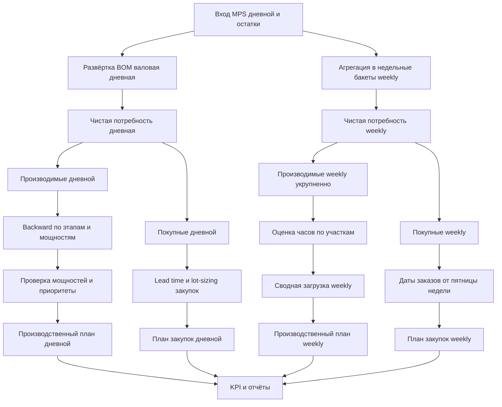

### Fix: MRP — унификация логики «Покраска» с модулем «Распределение этапов» (Сентябрь 2025)
- Симптом: в «Рекомендуемых заказах на производство» (страница результата прогона MRP) часть номенклатур (например, CP-000316-G) ошибочно попадала на малярный участок, тогда как в модуле «Распределение этапов» эти же позиции относились к другому этапу.
- Диагноз:
  - В функции планировщика [python.run_planning_run()](backend/app/services/planning_service.py:1173) внутренняя analyze_parent_item сначала корректно использует общий алгоритм [python.determine_parent_stage_and_norm()](backend/app/services/stage_logic.py:7), который определяет этап родителя ТОЛЬКО по единообразию stage_id у его непосредственных детей (или фиксирует неоднозначность).
  - Затем в MRP применялись дополнительные эвристики «покраски», которые перезаписывали результат:
    1) FORCE_PAINTING_FROM_OPERATIONS — если большинство операций спеки относилось к этапу «покраска», этап переписывался даже при однозначном этапе от детей ([backend/app/services/planning_service.py:1458](backend/app/services/planning_service.py:1458)).
    2) FORCE_PAINTING_BY_NAME — по признакам в наименовании/артикуле/коде (цвет, суффиксы SP/GSP и т.п.) этап переписывался на «покраску» ([backend/app/services/planning_service.py:1489](backend/app/services/planning_service.py:1489)).
  - Модуль «Распределение этапов» опирается только на единый stage_id прямых детей и не использует эвристики «по операциям»/«по имени»: [python.calculate_resource_distribution()](backend/app/services/resource_calculator.py:82). Поэтому результаты расходились.
- Изменения (backend):
  - Ограничена эвристика FORCE_PAINTING_FROM_OPERATIONS: теперь она применяется ТОЛЬКО если базовый алгоритм вернул stage_id = None (нет детей/нет stage у детей/смешанные дети), что согласуется с [python.determine_parent_stage_and_norm()](backend/app/services/stage_logic.py:92). См. правку в [backend/app/services/planning_service.py:1458](backend/app/services/planning_service.py:1458).
  - Отключена FORCE_PAINTING_BY_NAME по умолчанию и повешена на флаг конфигурации снапшота: production.toggles.force_painting_by_name=false (по умолчанию). Применяется только когда базовый алгоритм вернул stage_id = None. См. правку в [backend/app/services/planning_service.py:1489](backend/app/services/planning_service.py:1489).
- Эффект:
  - Алгоритм MRP теперь согласован с модулем «Распределение этапов». Этап родителя определяется по единообразию stage_id его прямых детей (или остаётся неопределённым с пометкой причины), без агрессивного «переназначения на покраску» при наличии корректных данных в составе.
  - Ожидается исчезновение расхождений по позициям вроде CP-000316-G. Возможные остаточные расхождения — только при проблемах в данных (NO_CHILD_STAGE / MIXED_CHILD_STAGES) или при «Закупка» в карточке номенклатуры (тогда планируется закупка, а не производство).
- Верификация:
  1) Проверить страницу «Распределение этапов» — этапы по изделиям должны соответствовать логике детей.
  2) Запустить прогон: POST /api/v1/plan/calc → открыть результат [frontend/src/pages/MRPResultPage.vue](frontend/src/pages/MRPResultPage.vue) и убедиться, что «Рекомендуемые заказы на производство» сгруппированы по тем же участкам, что и в «Распределении этапов».
- Конфигурация (опционально):
  - Для обратной совместимости эвристику «по имени» можно включить через версию конфигурации планирования:
    - В overrides/конфигурации: {"production":{"toggles":{"force_painting_by_name": true}}}
    - Управление версиями конфигурации: [python.create_planning_config_version()](backend/app/services/planning_service.py:152), [python.activate_planning_config_version()](backend/app/services/planning_service.py:194), эндпоинты в [python.plan router](backend/app/routers/plan.py:296).
### Fix: MRPResultPage — «Рекомендуемые заказы на производство» показывали «No data available» (Сентябрь 2025)
- Симптом: на странице результата прогона (/mrp/{runId}) блок «Рекомендуемые заказы на производство» отображал «No data available», несмотря на наличие данных в /api/v1/plan/results/{runId}/production.
- Причина:
  - В [function rebuildGroupedProductionOrders()](frontend/src/pages/MRPResultPage.vue:418) была жёсткая зависимость от предварительной загрузки справочников items/resources; при их задержке или 500-грешках группировка не строилась.
  - row-key у групповой таблицы был «order_id», тогда как строки — это группы по участкам.
  - Не выполнялась явная пересборка групп после успешной загрузки production.
- Изменения (frontend):
  - В [function rebuildGroupedProductionOrders()](frontend/src/pages/MRPResultPage.vue:418) убран ранний выход из-за пустых словарей; применяется фолбэк-название участка («Участок #ID») и номенклатуры («Номенклатура #ID»).
  - Добавлен вычисляемый источник строк [const groupedProdRows](frontend/src/pages/MRPResultPage.vue:405) с фолбэком: если по стадиям/участкам групп нет, показывается плоский список заказов.
  - Шаблон блока изменён: таблица теперь привязана к [groupedProdRows](frontend/src/pages/MRPResultPage.vue:92); для групп установлено row-key="area_id"; добавлен плоский фолбэк-рендер.
  - В конце [function loadProduction()](frontend/src/pages/MRPResultPage.vue:575) добавлен вызов rebuildGroupedProductionOrders() для гарантированной пересборки после прихода данных.
  - Для диагностики добавлены логи console.log «MRP groupedProductionOrders» и «MRP onMounted».
- Результат: после сборки/перезапуска фронтенда блок «Рекомендуемые заказы на производство» отображает данные, сгруппированные по участкам (видны, например, «Производственный участок: Участок #0 (ID: 0)», «Производственный участок: Участок #6 (ID: 6)»). Счётчики в сводке совпадают с данными (production_orders=3058).
- Примечания:
  - В консоли браузера остаются 404/500 при загрузке части справочников; UI теперь устойчив к этим ошибкам благодаря фолбэку. Рекомендуется отдельно проверить стабильность эндпоинтов /api/v1/items/ и /api/v1/resources/ на стороне backend (см. backend/app/routers/{items.py,resources.py}).
# Журнал изменений и прогресс разработки

Этот документ содержит ключевые изменения и реализованные функции в хронологическом порядке.

### Fix: Остатки = 0 на странице «Распределение этапов» (Сентябрь 2025)
- Проблема: после успешной синхронизации остатков на странице «Распределение этапов» все значения "Остаток" показывались как 0.
- Причина: в распределение попадали только компоненты с методом пополнения «Производство», закупаемые позиции (даже имеющие stage_id в составе) отфильтровывались и не отображались с их фактическими остатками.
- Изменения (backend):
  - В сервисе [backend/app/services/resource_calculator.py](backend/app/services/resource_calculator.py) снят фильтр по методу пополнения при формировании аккумулятора компонент по этапам: теперь в расчёт и выдачу включаются все компоненты, если для них распознан stage_id (в т.ч. «Покупка»).
  - Поле stock_qty по-прежнему берётся из Items.stock_qty, которое обновляется синхронизацией OData.
- Совместимость/эффект:
  - Теперь в выдаче появятся и закупаемые компоненты с их фактическими остатками, если у строк состава задан stage_id (или найден по fallback в дочерних спеках).
  - UI изменений не требует; страница «Распределение этапов» сразу корректно показывает остатки после нажатия «Распределить этапы».
- Проверка:
  - Нажать «Распределить этапы» на странице и убедиться, что колонка «Остаток» заполняется ненулевыми значениями для соответствующих позиций.
### Методика: Распределение этапов по дереву спецификации и расчет норматива (Сентябрь 2025)
- Единица распределения: родительский узел (деталь/изделие) на уровне, где у него есть дети.
- Этап вхождения родителя: определяется ТОЛЬКО по прямым детям этого уровня. Если у всех детей указан ОДИН и тот же stage_id = S, то этап родителя = S. Никакого fallback к «внукам»/«правнукам».
- Листья (материалы первой переработки): в распределение не попадают; они лишь определяют этап для родителя первого уровня ветви.
- Норматив (norm_hours) узла: сумма всех норм времени [SpecOperation.time_norm](backend/app/models.py:108) спецификации РОДИТЕЛЯ на этом уровне. Этап операций игнорируем, множителей не применяем («ни на что не умножаем»).
- Неоднозначности данных:
  - Если у детей одного уровня присутствуют разные stage_id (и речь именно о запасах/компонентах) — это ошибка спецификации. Такой узел помечается как ambiguous: MIXED_CHILD_STAGES.
  - Если у всех детей stage_id пуст — это ошибка спецификации: ambiguous: NO_CHILD_STAGE.
- Кратность: каждое вхождение родительской детали в дереве изделия учитывается отдельно; недопустимо схлопывать по item_id в рамках одного изделия.
- Маппинг этап→участок: по связям [ResourceStage](backend/app/models.py:252). Если кандидатов несколько — выбираем по текущей эвристике: по вхождению имени этапа в имя участка, иначе стабильный первый.

Изменения (backend, план работ)
- Переработать [`calculate_resource_distribution()`](backend/app/services/resource_calculator.py:81) и [`expand()`](backend/app/services/resource_calculator.py:129):
  - expand теперь добавляет в аккумулятор РОДИТЕЛСКИЕ узлы: ключ (stage_id, parent_item_id), без добавления детей.
  - Удалить fallback к «внукам».
  - Исключить умножение norm_hours на multiplier; norm_hours = сумма операций спецификации родителя.
  - Листья не добавляются в выдачу.
  - Убрать дедупликацию компонентов по item_id в продуктовом блоке: каждое вхождение родителя — отдельной записью.
  - Добавить сбор ambiguous-узлов с причиной (MIXED_CHILD_STAGES | NO_CHILD_STAGE) и вернуть их отдельным списком в ответе API (например, top-level поле "ambiguous": [...]). Это поле backward-compatible: фронтенд его может игнорировать.
- Распределение по участкам оставить прежним: подбор кандидатов по stage_id, затем выбор лучшего с эвристикой имени.
- Сортировки оставить прежними для стабильности.

Контракты API (миграция безломовая)
- Ответ [`get_resource_distribution()`](backend/app/routers/resources.py:19) по-прежнему возвращает:
  - "asOf": строка времени последней синхронизации остатков,
  - "resources": список участков с products[].components[].
- Изменение семантики components[]: теперь это записи родительских деталей, а не детей-материалов. Поля остаются прежними (item_id, item_code, item_name, stock_qty, norm_hours, stage_id, stage_name), что позволяет не менять UI.
- Дополнительно возвращается "ambiguous": список неоднозначных узлов (опционально). UI может отобразить на отдельной вкладке.

Контрольные проверки (acceptance)
- Узел P, чьи дети имеют единый stage_id=4 («Заготовка»), появляется на ресурсе, привязанном к 4, с norm_hours, равным сумме операций спеки P. Дети-листья не появляются в выдаче.
- Узел P с разношерстными stage_id детей → в "ambiguous" (MIXED_CHILD_STAGES), в "resources" не отображается.
- Узел P с пустыми stage_id всех детей → в "ambiguous" (NO_CHILD_STAGE).
- Два вхождения P в изделии увеличивают загрузку ресурса на 2×norm_hours(P); никаких схлопываний по item_id.

Статус: методика утверждена, рефакторинг backend готовится к внедрению. Точки изменений: [`resource_calculator.py`](backend/app/services/resource_calculator.py), в случае добавления "ambiguous" — только расширение JSON-ответа в [`resources.py`](backend/app/routers/resources.py:19) без изменений сигнатур.

## UI/Frontend

### Исправление прокрутки и фиксация Layout (Сентябрь 2025)
- **Проблема**: Наблюдалось дублирование полос прокрутки (внутренняя у страницы и внешняя у `body`), а шапка и боковая панель "плавали" при скролле.
- **Решение**: Проведена стандартизация `QLayout` в `MainLayout.vue` с использованием стандартной модели `view="lHh Lpr lFf"`. Удалены конфликтующие CSS-правила и ручные вычисления высоты (`:style-fn`), которые приводили к созданию нескольких контейнеров прокрутки.
- **Результат**: Проблема двойного скролла устранена. Шапка и боковая панель теперь корректно зафиксированы.

## Backend и Функциональность

### Feature: Страница "Спецификация" (Дерево BOM) (Сентябрь 2025)
- **Цель**: Реализовать иерархическое представление состава изделия (BOM) для быстрого анализа и выявления ошибок в этапах и нормах.
- **API Endpoints**:
  - `GET /api/v1/specification/tree`: Для "ленивой" (lazy-load) загрузки дочерних узлов.
  - `GET /api/v1/specification/full`: Для рекурсивной загрузки полного дерева спецификации с защитой от циклов.
- **Реализация**:
  - **Backend**: Разработаны роутеры и сервисы для построения дерева. В узлы включены расчетные поля (`treeQty`, `treeTimeNh`), метод пополнения (`replenishmentMethod`) и предупреждения (`NO_STAGE`, `NO_TIME_NORM`, `CYCLE_DETECTED`).
  - **Frontend**: Создана страница `SpecificationPage.vue` с использованием `QTable` в режиме дерева. Реализована логика для полной загрузки и автоматического раскрытия всех узлов. UI был упрощен для фокусировки на просмотре полного дерева.

### Feature: Синхронизация данных из 1С (Сентябрь 2025)
- **Синхронизация Единиц Измерения (ЕИ)**:
  - Реализован сервис `units_sync.py` и эндпоинт `POST /api/v1/sync/units-odata`.
  - В UI кнопка "Синхронизация номенклатуры" теперь последовательно запускает синхронизацию номенклатуры и связанных с ней единиц измерения.
  - В API спецификации GUID единицы измерения теперь разрешается в человекочитаемое краткое наименование.
- **Синхронизация Наименований Операций**:
  - **Проблема**: В дереве спецификации для операций отображался прочерк вместо названия.
  - **Решение**: Создан сервис `operations_sync.py` и эндпоинт `POST /api/v1/sync/operations-odata`, который извлекает наименования операций из связанных данных 1С. На странице "Синхронизация" добавлена соответствующая кнопка.

### Update: Количество на этапе и колонка «Сумма н/ч» (Сентябрь 2025)
- Количество детали на её этапе (qty_per_unit): произведение количеств по пути от корня до данного узла (occurrences). Для каждого пути формируется отдельная строка; агрегация по ресурсу выполняется суммированием.
- Норматив н/ч за единицу (norm_hours): сумма норм времени операций спецификации самого узла (уровня узла), без умножения на количество.
- Суммарный норматив (norm_hours_total): norm_hours × qty_per_unit. Добавлено в выдачу API и отображается в UI.
- Вкладки участков на странице распределения показывают суммарный norm_hours_total по ресурсу.
- Изменения:
  - Backend: поле norm_hours_total добавлено в строки распределения (см. backend/app/services/resource_calculator.py), расчёт total по ресурсу обновлён на сумму norm_hours_total.
  - Frontend: на странице распределения этапов добавлена колонка «Сумма н/ч», вычисляется из norm_hours_total (или как norm_hours × qty_per_unit при отсутствии явного поля) (см. frontend/src/pages/StagesPage.vue).

### Спецификация: Модуль планирования производства и закупок (Сентябрь 2025)
- Описание: двухконтурный MRP-модуль. Дневной контур на 90 дней с backward-планированием по этапам и проверкой мощностей. Weekly-контур за пределами непрерывного окна дневного плана с укрупнёнными расчётами по ISO-неделям (дата потребности недели — пятница). В этом релизе WIP не учитывается, приоритизация основана на критичности, важности и длительности цикла.

Подтверждённые политики и правила
- Горизонт и контуры:
  - Дневной контур: 90 дней.
  - Weekly-контур: включается для дат, выходящих за непрерывное окно дневного MPS.
- Критерий переключения на weekly:
  - D0 = сегодня; Dmax = D0 + 90 дней; Dcontig — максимальная непрерывная дата MPS в [D0, Dmax].
  - Потребности с датой ≤ Dcontig — дневной контур; &gt; Dcontig — weekly-контур.
- Weekly бакеты:
  - ISO-неделя, якорь понедельник; дата потребности недели — пятница.
- Lead time закупок:
  - LeadTime = max(DefaultLeadTime, LeadTime1C), где DefaultLeadTime = 30 дней (конфигурируемо).
- Safety stock:
  - 1% от спроса (конфигурируемо).
- Lot-sizing:
  - Закупка: MOQ — мин. партия из карточки номенклатуры, при отсутствии — 1; кратность = 1; округление вверх.
  - Производство: минимальная партия = 1; кратность = 1; округление вверх.
- Важность заказа:
  - Дефолт = 1 (до появления поля в MPS).
- Округление даты заказа:
  - В сторону предыдущего рабочего дня по календарю ресурсов.
- Учет мощностей:
  - Календари участков и коэффициенты мощности — из модуля ресурсов.
- Конфигурация модуля:
  - Хранение в таблице БД с версионированием и аудитом; доступ через API GET/PUT.

Точки интеграции (существующие сервисы)
- План MPS: [backend/app/services/plan_service.py](backend/app/services/plan_service.py); API: [backend/app/routers/plan.py](backend/app/routers/plan.py)
- BOM/спецификации: [backend/app/services/specification_sync.py](backend/app/services/specification_sync.py); API: [backend/app/routers/specification.py](backend/app/routers/specification.py)
- Этапы и нормы: [backend/app/services/production_stage_sync.py](backend/app/services/production_stage_sync.py), [backend/app/services/stages_calculator.py](backend/app/services/stages_calculator.py)
- Ресурсы/мощности: [backend/app/services/resource_calculator.py](backend/app/services/resource_calculator.py); API: [backend/app/routers/resources.py](backend/app/routers/resources.py)
- Остатки: [backend/app/services/odata_stock_sync.py](backend/app/services/odata_stock_sync.py)
- Схемы и модели: [backend/app/schemas.py](backend/app/schemas.py), [backend/app/models.py](backend/app/models.py)

API (проект)
- Конфигурация:
  - GET /config/planning — получить текущий planning_config (снимок и версия).
  - PUT /config/planning — частичное обновление конфигурации с валидацией и версионированием.
- Запуски планирования:
  - POST /plan/calc — запуск расчёта { horizon_days?, use_weekly?, config_overrides?, force? } → { run_id, status }.
  - GET /plan/runs — список прогонов (фильтры: статус, дата, пользователь).
  - GET /plan/results/{run_id} — сводка прогона (KPI, окна, предупреждения).
  - GET /plan/results/{run_id}/production — производственные заказы и этапы.
  - GET /plan/results/{run_id}/purchases — план закупок.
  - GET /plan/results/{run_id}/capacity — загрузка участков.
  - GET /plan/results/{run_id}/pegging — трассируемость компонент→изделия.
  - GET /plan/results/{run_id}/kpi — витрина KPI.

Сущности данных результата (будут задокументированы в .docs/db_schema.md)
- planning_run: id, параметры запуска (config_snapshot), время, статус, KPI.
- planned_order: run_id, item_id, qty, need_date, start_date, finish_date, route_ref, priority_index, bucket_type (daily|weekly).
- planned_order_stage: run_id, order_id, stage_id, area_id, date_or_week, hours.
- planned_purchase: run_id, item_id, qty, need_date, order_date (округление на предыдущий рабочий день), lead_time_days, priority_index, bucket_type.
- capacity_load: run_id, area_id, date_or_week, hours_planned, hours_available, overload_hours.
- pegging_link: run_id, child_item_id, parent_item_id, demand_ref, qty_contribution.

Формулы и приоритизация
- Валовая потребность: сумма по развёртке BOM по датам.
- Чистая потребность: Валовая − Остаток − WIP, где WIP=0 в этом релизе.
- Время операции: Количество × Норма времени.
- Индекс приоритета: 0.4×Критичность + 0.3×Важность + 0.3×Длительность цикла.
- Критичность: по горизонту до даты потребности и текущему остатку (без статистики расхода на первом этапе).

Диаграмма потока


Контрольные проверки (acceptance)
- Переключение контуров: потребности после Dcontig попадают в weekly-бакеты, дата потребности — пятница соответствующей недели.
- Закупки: дата заказа округляется до предыдущего рабочего дня по календарю ресурсов.
- Производство (дневной): backward-планирование по этапам укладывается в календари или маркируется перегрузка.
- Приоритизация: сортировка заказов соответствует индексу приоритета, критичные дефициты помечены.
- Трассируемость: для каждой плановой строки есть pegging до родительского спроса.

Статус
- Спецификация политики и API — утверждены. Переход к проектированию схемы БД результатов планирования и реализации сервисов расчёта.

### Init: Alembic и миграции для модуля планирования (Сентябрь 2025)
- Создана инфраструктура Alembic в backend:
  - Конфиг: [`backend/alembic.ini`](backend/alembic.ini)
  - Окружение: [`backend/alembic/env.py`](backend/alembic/env.py)
  - Ревизии:
    - Schema: [`backend/alembic/versions/20250925_01_add_mrp_planning_tables.py`](backend/alembic/versions/20250925_01_add_mrp_planning_tables.py)
    - Seed: [`backend/alembic/versions/20250925_02_seed_planning_config.py`](backend/alembic/versions/20250925_02_seed_planning_config.py)
- Содержимое schema-ревизии:
  - Таблицы: planning_config_versions, planning_run, planned_order, planned_order_stage, planned_purchase, capacity_load, pegging_link
  - Ограничения и индексы:
    - Partial UNIQUE (единственная активная конфигурация): planning_config_versions.is_active (WHERE is_active = TRUE)
    - CHECK bucket_type IN ('daily','weekly') для planned_order, planned_order_stage, planned_purchase, capacity_load
    - GIN по JSONB: planning_run.kpi, planning_run.warnings
    - Составные индексы по бакетам времени и ключевым полям выборки
- Содержимое seed-ревизии:
  - Заполняет planning_config_versions активной конфигурацией (version=1) согласно принятой политике (горизонт 90 дней, weekly ISO с пятницей, DefaultLeadTime=30, SafetyStock=1%, округление даты заказа на предыдущий рабочий день).
- Как запускать миграции:
  - Из каталога backend: `alembic upgrade head` (используется [`backend/alembic.ini`](backend/alembic.ini), БД берётся из переменной окружения DATABASE_URL либо значения по умолчанию из [`backend/app/database.py`](backend/app/database.py))
- Примечания:
  - ORM-модели в [`backend/app/models.py`](backend/app/models.py) будут синхронизированы позже (при необходимости), «истиной» для схемы является DDL в ревизиях Alembic.
  - Если требуется другой URL БД, заполнить переменную окружения `DATABASE_URL` или скорректировать в [`backend/alembic.ini`](backend/alembic.ini).

### Sync: ORM-модели для MRP табличного слоя (Сентябрь 2025)
- Добавлены ORM-модели, синхронизированные со схемой Alembic:
  - PlanningConfigVersion, PlanningRun, PlannedOrder, PlannedOrderStage, PlannedPurchase, CapacityLoad, PeggingLink в [`backend/app/models.py`](backend/app/models.py)
- Детали:
  - Типы и ограничения соответствуют миграциям: JSONB для config/kpi/warnings, CHECK по bucket_type, поля дат как Date, числовые поля с точностями.
  - Модели не создают таблицы сами: миграции остаются источником истины, `Base.metadata.create_all()` используется только как безопасная подстраховка.
- Статус: слой ORM синхронизирован с миграциями; готово к началу реализации сервисов расчёта (BOM-развёртка, неттинг, план закупок/производства).

### Backlog: Реализация модуля планирования — что доделать (Сентябрь 2025)
Контекст: подготовлены таблицы и индексы (Alembic), засеяна активная конфигурация, добавлены ORM-модели и базовые API «прогонов» (без вычислительной логики). Ссылки:
- Миграции: [backend/alembic/versions/20250925_01_add_mrp_planning_tables.py](backend/alembic/versions/20250925_01_add_mrp_planning_tables.py), [backend/alembic/versions/20250925_02_seed_planning_config.py](backend/alembic/versions/20250925_02_seed_planning_config.py)
- Конфиг Alembic: [backend/alembic.ini](backend/alembic.ini), окружение: [backend/alembic/env.py](backend/alembic/env.py)
- ORM модели: [backend/app/models.py](backend/app/models.py)
- Сервис планирования (заготовка, выдача результатов): [backend/app/services/planning_service.py](backend/app/services/planning_service.py)
- Роутер планов (добавлены эндпойнты прогона): [backend/app/routers/plan.py](backend/app/routers/plan.py)

Что реализовать далее (детализация по шагам)
1) Развёртка спроса и валовая потребность (daily + weekly)
- Реализовать рекурсивную BOM-развёртку с агрегированием валовой потребности по датам дневного контура и по неделям weekly-контура.
- Источники: спецификации и компоненты (таблицы и существующие сервисы), опора на актуальные «дефолтные» спецификации.
- Результаты: словари потребности по item_id в разрезе бакетов (daily: дата; weekly: пятница недели).
- Файлы: [backend/app/services/planning_service.py](backend/app/services/planning_service.py) (добавить модуль расчёта), для переиспользования структуры — [backend/app/services/resource_calculator.py](backend/app/services/resource_calculator.py) (ориентир по работе со спеками и этапами).

2) Неттинг с остатками и безопасный запас
- Чистая потребность = Валовая − Остаток − WIP (пока WIP=0).
- Применить SafetyStock=1% (из активной конфигурации) к валовой или чистой потребности согласно принятой политике (решение: к валовой, затем неттинг).
- Вход остатков: через текущие поля Items или сервис синхронизации 1С (см. [backend/app/services/odata_stock_sync.py](backend/app/services/odata_stock_sync.py)). Зафиксировать точку чтения (as-of).

3) Классификация потоков «производство» / «закупка»
- На основании replenishment_method и/или наличия маршрута/этапов. Производимые → производственный поток; покупные → закупка.
- Для позиций без явного replenishment_method — временная эвристика (по участию в BOM как родителя, наличию операций/этапов) с логгированием предупреждений.

4) Расчёт дат: закупки (lead time min-policy) и производство (backward)
- Закупки: order_date = need_date − max(DefaultLeadTime, Item.replenishment_time) округление к предыдущему рабочему дню (график из модуля ресурсов).
- Производство: backward-планирование по этапам с суммированием нормо-часов и раскладкой по календарям участков (учёт коэффициента мощности).
- Политики lot-sizing:
  - Закупка: MOQ из карточки, если нет — 1; кратность 1; округление вверх.
  - Производство: min_batch=1; кратность 1; округление вверх.

5) Проверка мощностей и формирование загрузки
- Для каждого участка вычислить hours_available по календарю и коэффициентам, hours_planned из сумм norm_hours по бакетам.
- При избытке плановой нагрузки — заполнить overload_hours и warnings; на первом этапе разрешён «перегруз» со статусом в отчёте (без авто-сдвига).

6) Приоритизация и очередь
- Вычислить коэффициент критичности (без истории расхода): на основе горизонта до даты потребности и текущего остатка; использовать ближайшие потребности как прокси расхода.
- Индекс приоритета из спецификации: 0.4×критичность + 0.3×важность (дефолт 1) + 0.3×длительность цикла.
- Сохранить в planned_order.priority_index; позволить сортировку выдач.

7) Трассируемость (pegging) и сохранение результатов прогона
- Для каждой позиции/бакета зафиксировать связи component → parent (с потребностью и вкладом по количеству).
- Сохранить planned_order, planned_order_stage, planned_purchase, capacity_load, pegging_link, KPI и warnings в рамках одного run.

8) Интеграция расчёта в POST /plan/calc
- Обновить реализацию обработки запроса: создавать run со статусом RUNNING, выполнять расчёт, сохранять результаты, завершать статусом SUCCESS/FAILED.
- Поддержать параметры: horizon_days, use_weekly, config_overrides; соблюсти политику переключения на weekly по Dcontig (см. спецификацию).

9) Выдачи API: фильтры и пагинация
- Добавить параметры фильтрации (по item_id, дате/неделе, участку, этапу) и пагинации к выдачам:
  - GET /results/{run_id}/production
  - GET /results/{run_id}/purchases
  - GET /results/{run_id}/capacity
  - GET /results/{run_id}/pegging
- Оптимизировать запросы и индексы (использовать уже созданные составные индексы по бакетам и датам).

10) UI и интеграция
- Добавить страницы/вкладки во фронтенде для:
  - Списка прогонов (статусы, KPI, предупреждения).
  - Производственного плана, плана закупок, загрузки участков, трассируемости.
- Потребуются вызовы новых API из фронтенда (см. [frontend/src/services/api.ts](frontend/src/services/api.ts), добавить методы).

11) Тестирование и пилот
- Синтетические наборы данных: простая BOM с 2-3 уровнями, разные этапы, узкое место по мощности.
- Юнит-тесты на ключевые преобразования: BOM-развёртка, неттинг, датировки (lead time и backward), lot-sizing, приоритизация, округление до рабочего дня.
- Интеграционные тесты прогона: end-to-end сохранение planned_* таблиц и вёрные KPI/overload.

12) Логирование и диагностика
- Писать warnings в planning_run.warnings (JSON): отсутствие stage_id у детей, смешанные этапы, перегрузы, нехватка спецификации, отсутствующий lead time и т.п.
- Вести замеры времени по этапам расчёта для будущей оптимизации.

13) Производительность и масштабируемость
- Пакетные инсёрты (bulk) в planned_* и capacity_load.
- Минимизация обращений к БД (кэш словарей, предварительная загрузка).
- Проверить GIN/BTREE индексы под выборки выдач.

14) Экспорт/отчёты
- Временный CSV/Excel-экспорт по прогону (на стороне бекенда) для производственного плана, закупок, загрузки.

Принятые политики (напоминание)
- Горизонт: 90 дней; переключение на weekly после Dcontig внутри окна.
- Weekly: ISO-неделя (якорь понедельник), точка потребности — пятница.
- Lead time: max(DefaultLeadTime=30, replenishment_time) с округлением даты заказа к предыдущему рабочему дню.
- Safety stock: 1% (конфигурируемый).
- Lot-sizing: закупка MOQ из карточки или 1; кратность 1, округление вверх. Производство min_batch=1; кратность 1, округление вверх.
- Приоритет: 0.4×критичность + 0.3×важность + 0.3×цикл (важность дефолт 1).

Критерии готовности (DoD) для следующего релиза
- POST /api/v1/plan/calc выполняет полный расчёт и сохраняет результаты; статус прогона корректен (RUNNING → SUCCESS/FAILED).
- Все таблицы planned_* / capacity_load / pegging_link заполняются корректно, без отрицательных остатков и с соблюдением бакетов.
- Выдачи GET /results/* поддерживают фильтры и возвращают согласованные данные с указанной пагинацией.
- UI отображает прогон, производственный план, закупки, загрузку и трассируемость; есть выгрузка CSV.
- Документация обновлена: «как запустить» и «как читать результаты» в .docs/.

### UI: Переименование дневного плана и добавление «План выпуска техники квартальный» (Сентябрь 2025)
- Переименован пункт меню и заголовок страницы:
  - Боковое меню: «План выпуска техники» → «План выпуска техники дневной» (см. [frontend/src/layouts/MainLayout.vue](frontend/src/layouts/MainLayout.vue))
  - Заголовок страницы дневного плана: «План выпуска техники дневной» (см. [frontend/src/pages/PlanPage.vue](frontend/src/pages/PlanPage.vue:7))
- Добавлена новая страница «План выпуска техники квартальный»:
  - Новый маршрут: path /plan/quarterly, name plan-quarterly (см. [frontend/src/router/index.ts](frontend/src/router/index.ts:22))
  - Новый пункт меню: «План выпуска техники квартальный» с иконкой calendar_view_week (см. [frontend/src/layouts/MainLayout.vue](frontend/src/layouts/MainLayout.vue))
  - Реализована страница [frontend/src/pages/PlanQuarterlyPage.vue](frontend/src/pages/PlanQuarterlyPage.vue) по аналогии с дневной, но:
    - Диапазон планирования: текущий квартал
    - Шаг планирования: неделя (ISO-неделя), колонки таблицы формируются как Wxx пт dd.mm (пятница недели)
    - Загрузка данных через существующий API матрицы: POST /v1/plan/matrix с датами внутри квартала и последующей агрегацией по неделям
    - Сохранение изменений: недельные значения сохраняются датой «пятница» соответствующей ISO-недели через POST /v1/plan/bulk_upsert
- Примечания по реализации квартальной страницы:
  - Добавлены функции вычисления ISO-недели и «пятницы» недели, агрегация дневных значений в недельные колонки, пересчет суммарного квартального плана по строке
  - Добавлена обработка пагинации и поиск номенклатуры по аналогии с дневной

### Feature: Предпросчёт MRP (валовая/чистая потребность) и эндпойнт предпросмотра (Сентябрь 2025)
- Назначение: быстрый расчёт валовой (BOM-развёртка) и чистой (неттинг с остатками) потребности в бакетах времени без записи результатов в БД, для валидации методики и интеграции с будущими сохранениями.
- Реализация (backend):
  - Сервис предпросмотра: [python.compute_planning_preview()](backend/app/services/planning_service.py:340)
    - Конфигурация: робастная загрузка активной версии [python.get_active_planning_config()](backend/app/services/planning_service.py:102) с преобразованием JSONB/строки/маппинга в dict и fallback на [python.DEFAULT_PLANNING_CONFIG](backend/app/services/planning_service.py:25).
    - Горизонт: horizon_days по конфигурации; переключение на weekly по Dcontig (максимальная непрерывная дата дневного MPS).
    - Weekly бакеты: пятница ISO-недели (якорь понедельник).
    - Валовая потребность: рекурсивная BOM‑развёртка по «дефолтным» спецификациям (DefaultSpecification + SpecComponent) с аккумулированием по бакетам daily/weekly.
    - Safety stock: применяется к валовой потребности (процент из конфигурации).
    - Неттинг: последовательное вычитание остатков Items.stock_qty по дате (WIP=0 в этом релизе), результат формируется отдельно для daily и weekly.
    - Возвращаемая структура: 
      - meta: asOf, d0, dmax, dcontig
      - config: snapshot ключевых параметров
      - gross: { daily: {item_id: {YYYY-MM-DD: qty}}, weekly: {item_id: {YYYY-MM-DD(Friday): qty}} }
      - net: аналогично gross, после неттинга
      - stats: счётчики по номенклатурам и бакетам
  - Эндпойнт предпросмотра: [python.calc_preview()](backend/app/routers/plan.py:213) → POST /api/v1/plan/calc_preview
    - Параметры: { horizon_days?, use_weekly?, config_overrides? }
    - Ответ: { status: "ok", preview: { meta, config, gross, net, stats } }
- Устойчивость:
  - Конфигурация планирования загружается с защитой от «dictionary update sequence…» и других ошибок парсинга.
  - Слияние overrides через безопасный deep-merge; при недоступности активной конфигурации применяется дефолт.
- Проверка:
  - /health → 200 OK
  - /api/v1/plan/calc_preview → 200 OK; присутствует в OpenAPI (paths /api/v1/plan/calc_preview)
  - Пример запроса:
    - curl -s -S -X POST http://localhost:8000/api/v1/plan/calc_preview -H "Content-Type: application/json" -d "{\"horizon_days\":90,\"use_weekly\":true}"
- Примечания:
  - Источники: DefaultSpecification, SpecComponent, ProductionPlanEntry (как дневной MPS), Items.stock_qty (as-of фиксируется по config/last_sync_time.json при наличии).
  - Weekly-политика: бакет — пятница ISO‑недели; переключение на weekly после Dcontig внутри горизонта.
- Следующие шаги:
  - Сохранение прогона (RUNNING→SUCCESS/FAILED), запись planned_order/planned_order_stage/planned_purchase/capacity_load/pegging_link, KPI и warnings.
  - Выдачи /results/* с фильтрами и пагинацией; интеграция с UI.

### Спецификация: Единый редактор квартального плана (недели с разворотом в дни) — утверждено (Сентябрь 2025)

Статус: утвержден второй вариант с дополнениями:
- Автоповышение недельного плана при превышении суммы по дням — включено по умолчанию.
- Прошедшие периоды не отображаются вообще (ни недели, ни дни прошедших дат).

Цели
- Единая таблица редактирования квартального плана по неделям с ручным распределением на дни через разворот.
- Ввод по дням уменьшает остаток недельной ячейки строки; соблюдается инвариант Σ(дней недели) = план недели.
- Дневная таблица становится read-only; отображает только заполненные ячейки из квартального плана и подчиняется тем же правилам по текущей неделе/прошедшим периодам.

Данные и инварианты
- Источник истины — записи по датам в таблице production_plan_entries (ORM: [ProductionPlanEntry](backend/app/models.py:267)).
- Недельный план хранится датой «пятница ISO‑недели» как укрупнённая запись недели. Расклады по дням этой недели — отдельные записи Mon..Sun.
- Остаток недели (пятница в UI разворота) — вычисляемый и read‑only: remainder = week_target − Σ(видимых дней кроме пятницы). При автоповышении (включено по умолчанию) при Σ(дней) &gt; week_target выполняется week_target := Σ(дней), remainder := 0.
- Инвариант: Σ(7 дней недели) = план недели. Негативные значения запрещены; допускаются только целые/неотрицательные.

API и совместимость
- Чтение матрицы — без изменений через [python.query_plan_matrix_paginated()](backend/app/services/plan_service.py:21); фронтенд агрегирует по неделям (ключ недели = пятница ISO).
- Сохранение — без изменений через пакетный upsert [python.bulk_upsert_plan_entries()](backend/app/services/plan_service.py:205).
- Эндпоинты MRP предпросмотра/прогонов без изменений: [python.calc_preview()](backend/app/routers/plan.py:214), [python.start_planning_run()](backend/app/routers/plan.py:192), [python.create_planning_run()](backend/app/services/planning_service.py:116).

Правила UI/UX — Квартальная таблица (редактируемая) [frontend/src/pages/PlanQuarterlyPage.vue]
- Колонки недель: показываются только текущая неделя и все будущие недели квартала. Прошедшие недели скрываются полностью.
- Порядок колонок: текущая неделя первой, затем будущие недели по возрастанию.
- Разворот недели (иконка/кнопка в шапке колонки) открывает панель из 7 дней:
  - Текущая неделя: показываются только дни начиная СЕГОДНЯ → до конца недели (Mon..today−1 скрыты как прошедшие).
  - Будущие недели: показываются все 7 дней (Mon..Sun).
  - День «Пт» (пятница) — read‑only как остаток. Остаток учитывает все дни недели, в том числе скрытые прошедшие (если такие значения существуют в данных).
- Валидации:
  - По умолчанию включено автоповышение недельного плана. При Σ(дней) &gt; план недели — устанавливаем план недели = Σ(дней), остаток=0, подсветка информирует об автокоррекции.
  - В режиме вручную (если опцию отключить в будущем) — при превышении показывать ошибку «Превышение плана недели» и блокировать сохранение.
- Сохранение:
  - Для каждого изменённого дня Mon..Thu/Sat/Sun: отправляется upsert даты (YYYY‑MM‑DD).
  - Для пятницы: отправляется upsert вычисленного остатка (может быть 0 — идемпотентно).
  - Перед отправкой пересчитывается сумму недели и применяется политика автоповышения (по умолчанию включена).

Правила UI/UX — Дневная таблица (read‑only) [frontend/src/pages/PlanPage.vue]
- Инпуты заблокированы; изменение данных недоступно.
- Фильтрация:
  - Отображаются только строки/дни, где есть ненулевые значения из квартального плана.
  - Прошедшие дни скрываются полностью; для текущей недели показываются только дни начиная с СЕГОДНЯ и позже.
- Данные берутся через тот же /v1/plan/matrix; фронт отбрасывает нулевые и прошедшие даты до отображения.

Политики и настройки
- Автоповышение недельного плана при превышении суммы по дням — включено по умолчанию (toggle в будущем можно вынести в настройки UI).
- Поддержка графика 5/2: суббота/воскресенье могут отображаться серым как нерабочие; хранение допускает значения (при необходимости скрытие нерабочих можно включить настройкой позже).

Приёмочные критерии
- Прошедшие недели/дни не отображаются нигде. Текущая неделя в развороте показывает только дни от СЕГОДНЯ включительно; будущие недели показывают все 7 дней.
- Ввод по дням корректно перераспределяет остаток недели; при превышении автоповышение применяется по умолчанию, остаток становится 0.
- Дневная таблица отображает только будущие (включая сегодня) ненулевые ячейки и остаётся read‑only.
- Все операции выполняются через существующие эндпоинты без изменений схемы БД.

План внедрения (UI‑только, без изменений схемы/эндпоинтов)
1) Реализация разворота недель в дни на квартальной странице с локальной моделью остатков, скрытием прошедших периодов и пакетным сохранением через [python.bulk_upsert_plan_entries()](backend/app/services/plan_service.py:205).
2) Перевод дневной страницы в режим read‑only, скрытие прошедших дат и фильтрация нулевых, соблюдение правил для текущей недели.
3) Документация: этот раздел, примечания об автоповышении и «пятница=остаток», правила скрытия прошедших периодов.
4) UX‑тесты: превышение и автоповышение, границы недели/квартала, отсутствие отображения прошедших периодов, корректность сумм.

Ссылки на реализацию
- Чтение матрицы: [python.query_plan_matrix_paginated()](backend/app/services/plan_service.py:21)
- Массовое сохранение: [python.bulk_upsert_plan_entries()](backend/app/services/plan_service.py:205)
- Роутер плана: [python.export_plan()](backend/app/routers/plan.py:317), [python.get_plan_matrix()](backend/app/routers/plan.py:81)
- ORM запись плана: [python.ProductionPlanEntry](backend/app/models.py:267)

### UI: Реализация шагов 1–2 единого редактора квартального плана (Сентябрь 2025)

Изменения во frontend согласно утвержденной спецификации (автоповышение включено по умолчанию; прошедшие периоды не отображаются):

1) Квартальный план — недели с разворотом на дни
- Файл: [frontend/src/pages/PlanQuarterlyPage.vue](frontend/src/pages/PlanQuarterlyPage.vue)
- Добавлен разворот ячейки недели в popup с 7 днями. Для текущей недели показываются только дни начиная с «сегодня»; будущие недели показывают все 7 дней.
- Остаток недели (пятница) вычисляется как remainder = week_target − Σ(прочих дней). Поле пятницы — read-only. При превышении суммы дней автоповышение: week_target := Σ(дней), остаток = 0.
- Недели реорганизованы: текущая неделя — первая колонка; отображаются только текущая и будущие недели (прошедшие скрыты).
- Сохранение: изменения по дням отправляются как upsert дат, остаток недели (пятница) — отдельным upsert. Используются существующие API [python.bulk_upsert_plan_entries()](backend/app/services/plan_service.py:205) и [python.get_plan_matrix()](backend/app/routers/plan.py:81).

2) Дневной план — read-only и фильтрация будущих ненулевых
- Файл: [frontend/src/pages/PlanPage.vue](frontend/src/pages/PlanPage.vue)
- Инпуты по дням заменены на статический вывод (read-only); кнопка «Сохранить изменения» отключена; удаление строк скрыто.
- В таблице отображаются только будущие даты (включая «сегодня») и только те колонки/строки, где есть ненулевые значения из квартального плана.
- Пересчет month_plan производится только по видимым (ненулевым) будущим датам.

Без изменений backend и схемы БД
- Чтение матрицы: [python.query_plan_matrix_paginated()](backend/app/services/plan_service.py:21)
- Массовое сохранение: [python.bulk_upsert_plan_entries()](backend/app/services/plan_service.py:205)
- ORM запись плана: [python.ProductionPlanEntry](backend/app/models.py:267)

### UI: Квартальный план — расширение горизонта, сужение колонок, фиксация «Изделие», удаление «Код» (Сентябрь 2025)
- Расширен горизонт отображения: теперь страница показывает текущую неделю и все последующие недели до конца квартала плюс дополнительно +4 недели. Изменение реализовано в запросе матрицы планов — параметр days увеличен на 28 в [typescript.loadPlanData()](frontend/src/pages/PlanQuarterlyPage.vue:538).
- Колонка «Код» удалена из таблицы квартального плана. Конфигурация столбцов переработана в [typescript.columns()](frontend/src/pages/PlanQuarterlyPage.vue:441): оставлены «Изделие», «Артикул», «План на квартал» и динамические недельные/дневные колонки.
- Сужены ширины колонок недель и дней:
  - Для динамических столбцов недель/дней добавлены классы узких колонок в [typescript.columns() добавление day-колонок](frontend/src/pages/PlanQuarterlyPage.vue:500) и [typescript.columns() добавление week-колонок](frontend/src/pages/PlanQuarterlyPage.vue:515).
  - Инпуты в ячейках недель и дней получили компактные классы в шаблоне [vue.template q-input для week_*](frontend/src/pages/PlanQuarterlyPage.vue:82) и [vue.template q-input для day_*](frontend/src/pages/PlanQuarterlyPage.vue:94), пятница недели — вычисляемый остаток, readonly [vue.template q-input friday](frontend/src/pages/PlanQuarterlyPage.vue:111).
  - Добавлены CSS-стили для .narrow-col/.narrow-input в конце файла [css узкие столбцы и инпуты](frontend/src/pages/PlanQuarterlyPage.vue:887).
- «Изделие» закреплено слева при горизонтальной прокрутке (sticky) — поведение подтверждено, реализация уже была в стилях [css .sticky-name](frontend/src/pages/PlanQuarterlyPage.vue:838).

Поведение и валидации (без изменений логики):
- Прошедшие недели полностью скрываются; текущая неделя показывается первой, далее будущие по возрастанию; неделя включается в таблицу, если содержит хотя бы один день ≥ сегодня (см. упорядочивание и фильтрацию в [typescript.loadPlanData()](frontend/src/pages/PlanQuarterlyPage.vue:568)).
- В развороте недели скрыты прошедшие дни для текущей недели; будущие недели показывают все 7 дней (см. [typescript.getVisibleWeekDays()](frontend/src/pages/PlanQuarterlyPage.vue:355)).
- Пятница — остаток недели, вычисляется как week_target - Σ(остальные дни), с автоповышением при превышении суммы по дням (см. [typescript.computeFridayRemainder()](frontend/src/pages/PlanQuarterlyPage.vue:366) и [typescript.recalcWeekAfterDayChange()](frontend/src/pages/PlanQuarterlyPage.vue:379)).

Совместимость:
- Backend и схемы БД не менялись; используется существующий эндпоинт /v1/plan/matrix, но с расширенным диапазоном дат.
- Сохранение по дням и пятницам работает через текущий /v1/plan/bulk_upsert.

Приёмочные критерии:
- Таблица квартального плана отображает текущую и все будущие недели текущего квартала плюс +4 дополнительные недели, даже если в данных пока нули.
- Колонка «Код» отсутствует, «Изделие» зафиксировано слева и не прокручивается при горизонтальном скролле.
- Колонки недель и дней стали визуально уже, инпуты компактнее, не ломают разметку.

### UI: Дневной план — горизонтальный скролл, фиксация «Изделие», удаление «Код» (Сентябрь 2025)
- Убрана колонка «Код» из таблицы дневного плана. Обновлена конфигурация колонок в [frontend/src/pages/PlanPage.vue](frontend/src/pages/PlanPage.vue).
- Добавлен горизонтальный скролл вокруг таблицы:
  - Обернул `<q-table>` в контейнеры `.h-scroll` и `.h-scroll-inner`, таблице добавлены `table-class="wide-table"` и `:table-style="{ width: 'max-content', whiteSpace: 'nowrap' }"`, `:wrap-cells="false"`.
  - CSS стили для горизонтального скролла и «ширины по содержимому» добавлены в конец [frontend/src/pages/PlanPage.vue](frontend/src/pages/PlanPage.vue).
- Зафиксированы слева колонки «Действия» и «Изделие»:
  - Используются существующие классы `sticky-actions` и `sticky-name` в [frontend/src/pages/PlanPage.vue](frontend/src/pages/PlanPage.vue). При горизонтальной прокрутке наименование остаётся на месте.

Приёмочные критерии:
- На странице «План выпуска техники дневной» колонка «Код» отсутствует.
- Таблица прокручивается горизонтально, даты не ужимаются.
- «Изделие» и кнопки действий закреплены слева и не прокручиваются вместе с датами.

### UI: Квартальный план — фиксация левых колонок (z-index) (Сентябрь 2025)
- Для корректной фиксации левых колонок при горизонтальной прокрутке увеличен z-index:
  - `sticky-actions` → `z-index: 20`
  - `sticky-name` → `z-index: 19`
- Изменения применены в стилях [frontend/src/pages/PlanQuarterlyPage.vue](frontend/src/pages/PlanQuarterlyPage.vue).

Примечание:
- Ранее на квартальной странице уже выполнены: удаление «Код», сужение колонок недель/дней, горизонт = 12 недель квартала + 4 дополнительные (всего 16 недель), и горизонтальный скролл.

### UI: Квартальный план — фиксация первой колонки (Сентябрь 2025)
- Исправлена фиксация левых колонок в таблице квартального плана:
  - В шапке таблицы применяются headerClasses из описания колонок, чтобы sticky-классы работали и для th-элементов. Изменения в файле [frontend/src/pages/PlanQuarterlyPage.vue](frontend/src/pages/PlanQuarterlyPage.vue).
  - Отключён внутренний overflow у контейнеров QTable, чтобы sticky-элементы фиксировались относительно внешнего горизонтального скролла .h-scroll. Изменения в CSS секции файла [frontend/src/pages/PlanQuarterlyPage.vue](frontend/src/pages/PlanQuarterlyPage.vue).
  - Повышены z-index у фиксированных колонок: sticky-actions → 20, sticky-name → 19. Файл [frontend/src/pages/PlanQuarterlyPage.vue](frontend/src/pages/PlanQuarterlyPage.vue).

Результат:
- Первая колонка (действия) и колонка «Изделие» закреплены слева и остаются на месте при горизонтальной прокрутке таблицы квартального плана.

### Feature: Валовая потребность (BOM) — отдельный предпросчёт и эндпойнт (Сентябрь 2025)
- Назначение: вынести расчёт валовой потребности (BOM‑развёртка) в отдельный, быстрый эндпойнт без неттинга и без записи в БД — для валидации методики и профилирования.
- Реализация (backend):
  - Добавлена функция предпросчёта валовой потребности [python.compute_gross_requirements()](backend/app/services/planning_service.py:349).
    - Вход: horizon_days?, use_weekly?, config_overrides?
    - Политики: переключение на weekly после Dcontig (пятница ISO‑недели как бакет), применение safety_stock_percent к gross.
    - Источники: ProductionPlanEntry (MPS, дневные записи), DefaultSpecification + SpecComponent (BOM).
    - Защита от циклов и глубины, кэши спецификаций/компонентов.
  - Добавлен эндпойнт [python.router.calc_gross()](backend/app/routers/plan.py:236) → POST /api/v1/plan/calc_gross
    - Ответ: { status: "ok", gross: { meta, config, gross, stats } }
    - Структура gross.gross:
      - daily: { "<item_id>": { "YYYY-MM-DD": qty, ... }, ... }
      - weekly: { "<item_id>": { "YYYY-MM-DD(Friday)": qty, ... }, ... }
    - meta: asOf (время последней синхронизации остатков из config/last_sync_time.json при наличии), d0/dmax/dcontig
    - config: снимок horizon_days, weekly_enabled, safety_stock_percent, config_version_id
- Smoke‑тест:
  - Проверка OpenAPI:
    - curl -s http://localhost:8000/openapi.json | jq '.paths|keys[]' | grep "/api/v1/plan/calc_gross"
  - Вызов по умолчанию (90 дней, weekly включён по конфигурации):
    - curl -s -S -X POST http://localhost:8000/api/v1/plan/calc_gross -H "Content-Type: application/json" -d "{}"
  - Ожидаемое: HTTP 200, JSON со структурой { status: "ok", gross: { meta, config, gross: {daily,weekly}, stats } }
- Совместимость:
  - Не меняет существующие контракты предпросмотра [python.calc_preview()](backend/app/routers/plan.py:215) и расчёта MRP; новый эндпойнт — доп. инструмент.
  - Фронтенд может использовать /calc_gross для быстрых проверок без затрагивания расчёта net или сохранений.
- Примечания:
  - Реализация переиспользует методологию переключения на weekly (якорь понедельник, бакет — пятница) и применение safety_stock_percent к валовой потребности.
  - Для последующих шагов сохранения прогонов / результатов — планируется выделить общий расчётный слой (гросс/неттинг) для повторного использования.

### Backend: Выдачи /results/* — фильтры и пагинация (Сентябрь 2025)
- Реализация:
  - Добавлены фильтры и пагинация для выдач результатов прогона.
  - Эндпойнты:
    - GET /api/v1/plan/results/{run_id}/production — параметры: item_id?, bucket_type? (daily|weekly), date_from?, date_to?, limit?, offset?; роутер [python.get_planning_result_production](backend/app/routers/plan.py:284) → сервис [python.get_run_production()](backend/app/services/planning_service.py:235)
    - GET /api/v1/plan/results/{run_id}/purchases — параметры: item_id?, bucket_type?, date_from?, date_to?, limit?, offset?; роутер [python.get_planning_result_purchases](backend/app/routers/plan.py:311) → сервис [python.get_run_purchases()](backend/app/services/planning_service.py:272)
    - GET /api/v1/plan/results/{run_id}/capacity — параметры: area_id?, bucket_type?, date_from?, date_to?, limit?, offset?; роутер [python.get_planning_result_capacity](backend/app/routers/plan.py:338) → сервис [python.get_run_capacity()](backend/app/services/planning_service.py:292)
    - GET /api/v1/plan/results/{run_id}/pegging — параметры: child_item_id?, parent_item_id?, date_from?, date_to?, limit?, offset?; роутер [python.get_planning_result_pegging](backend/app/routers/plan.py:365) → сервис [python.get_run_pegging()](backend/app/services/planning_service.py:308)
- Детали реализации:
  - В сервисных методах добавлены where‑фильтры по параметрам, сортировки по bucket_date и ключам, а также возврат total/limit/offset для пагинации.
  - Исправлена обработка HTTP ошибок в роутере (detail=str(e)).
- Совместимость:
  - Параметры optional, при их отсутствии выдачи ведут себя как раньше (без фильтров, без пагинации ограничений — возвращают весь набор в пределах лимита по умолчанию).
- Пример:
  - GET /api/v1/plan/results/1/purchases?bucket_type=weekly&date_from=2025-10-01&limit=50

### План инкремента: приоритеты, стадии, мощность, пеггинг (Сентябрь 2025)

Исходная точка
- Реализованы предпросчёты валовой/чистой потребности:
  - Гросс: [python.compute_gross_requirements()](backend/app/services/planning_service.py:458)
  - Предпросмотр gross+net: [python.compute_planning_preview()](backend/app/services/planning_service.py:642)
  - Эндпойнты: [python.calc_gross()](backend/app/routers/plan.py:239), [python.calc_preview()](backend/app/routers/plan.py:218)
- Реализован базовый прогон RUNNING→SUCCESS с сохранением заявок на закупки и производственных заказов (без стадий/мощностей):
  - [python.run_planning_run()](backend/app/services/planning_service.py:939)
- Выдачи результатов с фильтрами/пагинацией:
  - Production: [python.get_planning_result_production](backend/app/routers/plan.py:284) → [python.get_run_production()](backend/app/services/planning_service.py:235)
  - Purchases: [python.get_planning_result_purchases](backend/app/routers/plan.py:311) → [python.get_run_purchases()](backend/app/services/planning_service.py:306)
  - Capacity: [python.get_planning_result_capacity](backend/app/routers/plan.py:338) → [python.get_run_capacity()](backend/app/services/planning_service.py:351)
  - Pegging: [python.get_planning_result_pegging](backend/app/routers/plan.py:365) → [python.get_run_pegging()](backend/app/services/planning_service.py:392)

Цель инкремента
- Дополнить расчёт прогона стадиями, загрузкой мощностей, пеггингом и индексом приоритета, не нарушая текущие контракты API и схемы БД.

Область работ

1) Индекс приоритета planned_order/ planned_purchase
- Формула (из спецификации): priority_index = 0.4 × criticality + 0.3 × importance + 0.3 × cycle_time
  - importance: из конфигурации по умолчанию [python.DEFAULT_PLANNING_CONFIG.prioritization.default_importance](backend/app/services/planning_service.py:39) = 1
  - criticality (приближённо, без истории расхода): 
    - Для бакета date: days_to_need = max(1, (need_date - d0).days)
    - stock_factor = 1, если остаток (Items.stock_qty) для item_id после неттинга ≈ 0 вблизи периода потребности; иначе 0.5
    - criticality = 1/days_to_need × (1 + stock_factor)
  - cycle_time (приблизительно): 
    - Для production — сумма норм времени по спецификации узла (см. ниже) в часах → нормировать в [0..1] по перцентилям набора RUN
    - Для purchase — взять lead_time_days, нормировать в [0..1] по перцентилям
- Где ставить:
  - Производство: [python.run_planning_run()](backend/app/services/planning_service.py:939) при создании [python.PlannedOrder](backend/app/models.py:329)
  - Закупка: там же при создании [python.PlannedPurchase](backend/app/models.py:366)

2) Формирование стадий PlannedOrderStage
- Методика:
  - Этап узла-родителя определяется ТОЛЬКО по прямым детям его спецификации:
    - Если у всех детей stage_id один и тот же — он же и этап родителя
    - Если разные — ambiguous: MIXED_CHILD_STAGES
    - Если у всех пусто — ambiguous: NO_CHILD_STAGE
  - Норматив узла (norm_hours): сумма [python.SpecOperation.time_norm](backend/app/models.py:116) по спецификации РОДИТЕЛЯ (stage операций игнорируем, множители не применяем)
  - Часы бакета для узла: norm_hours × qty_in_bucket (кол-во родителя в бакете)
- Техника:
  - Переиспользовать подход развёртки «родителей» из [python.calculate_resource_distribution()](backend/app/services/resource_calculator.py:82) и её вспомогательный expand-алгоритм:
    - Единица распределения — узел-родитель на уровне со своими детьми
    - Для каждого узла-родителя получить stage_id и norm_hours
  - Маппинг этап→участок: через [python.ResourceStage](backend/app/models.py:253) с эвристикой имени (как в resource_calculator)
- Запись:
  - На каждый [python.PlannedOrder](backend/app/models.py:329) по каждому бакету создать 1 строку [python.PlannedOrderStage](backend/app/models.py:350) с:
    - run_id, order_id, stage_id, area_id (подобранный участок), bucket_type (daily/weekly), bucket_date (дата бакета), hours

3) Загрузка мощностей CapacityLoad
- Расчёт:
  - hours_planned: сумма PlannedOrderStage.hours по (area_id, bucket_type, bucket_date)
  - hours_available:
    - По [python.ProductionResource.daily_work_hours](backend/app/models.py:248) × рабочих дней бакета × коэффициент мощности capacity (как множитель)
    - Календарь 5/2: рабочие дни Mon..Fri; для daily — 1 или 0; для weekly — 5
  - overload_hours = max(0; hours_planned − hours_available)
- Запись: [python.CapacityLoad](backend/app/models.py:385)

4) Трассируемость PeggingLink
- При развёртке BOM для бакета: для каждого вклада компонента сформировать связь child_item_id → parent_item_id с qty_contribution и need_date (дата бакета), parent_need_date (дата бакета родителя).
- Запись: [python.PeggingLink](backend/app/models.py:401)
- Упрощение этапа: pegging по чистой потребности (net) без разнесения по путям MPS; одного уровня parent достаточно на первом инкременте.

5) KPI и Warnings
- KPI (в [python.run_planning_run()](backend/app/services/planning_service.py:939)):
  - orders_created, purchases_created, items_involved (уже есть)
  - capacity_overload_total (сумма overload_hours), overloaded_buckets (кол-во бакетов с перегрузом), stages_count
- Warnings:
  - PREVIEW_NO_NET (есть)
  - NO_CHILD_STAGE / MIXED_CHILD_STAGES — с указанием item_id/spec_id
  - CAPACITY_OVERLOAD — если есть перегрузы на участках
- Сохранить в PlanningRun.warnings/KPI.

Пошаговая интеграция в код (без изменений сейчас; план для разработки)
- Обновить [python.run_planning_run()](backend/app/services/planning_service.py:939):
  1) После формирования net-бакетов собрать словарь qty по item_id×bucket для производства
  2) На основании expand-логики родительских узлов (по дефолтным спекам) рассчитать для каждого item_id:
     - stage_id, norm_hours (на узел), area_id (по ResourceStage)
  3) Для каждого PlannedOrder создать соответствующие PlannedOrderStage с рассчитанными hours
  4) Агрегировать PlannedOrderStage в CapacityLoad
  5) Рассчитать priority_index и записать его в PlannedOrder/PlannedPurchase
  6) Записать PeggingLink при развёртке (child→parent по бакету)
  7) Сформировать KPI/warnings и закрыть RUN (SUCCESS/FAILED)

Приёмочные критерии (acceptance)
- Для узла P, у которого дети одного этапа S:
  - В PlannedOrderStage появляется строка с stage_id=S и hours = norm_hours(P) × qty(bucket)
  - В CapacityLoad по участку, привязанному к S, учтены эти часы
- Узлы с MIXED_CHILD_STAGES/NO_CHILD_STAGE не попадают в PlannedOrderStage; предупреждения записаны в RUN.warnings
- CapacityLoad отражает перегрузы (overload_hours > 0) при недостатке доступных часов
- priority_index заполнен у всех PlannedOrder/PlannedPurchase по формуле
- Эндпойнты /results/* возвращают данные с фильтрами по bucket_type/date_from/date_to

Зависимости и данные
- Спецификации: [python.DefaultSpecification](backend/app/models.py:211), [python.SpecComponent](backend/app/models.py:85), [python.SpecOperation](backend/app/models.py:109)
- План MPS (дневной): [python.ProductionPlanEntry](backend/app/models.py:267)
- Ресурсы и привязки: [python.ProductionResource](backend/app/models.py:234), [python.ResourceStage](backend/app/models.py:253)
- Таблицы результатов: [python.PlanningRun](backend/app/models.py:313), [python.PlannedOrder](backend/app/models.py:329), [python.PlannedOrderStage](backend/app/models.py:350), [python.PlannedPurchase](backend/app/models.py:366), [python.CapacityLoad](backend/app/models.py:385), [python.PeggingLink](backend/app/models.py:401)

Примечания по совместимости
- Контракты API не меняются; новые данные появляются в существующих выдачах /results/*
- Миграции не требуются: все таблицы уже предусмотрены в Alembic-схеме

Статус
- План инкремента согласован, готово к реализации. Для начала разработки требуется подтверждение на внесение изменений в:
  - [python.planning_service.py](backend/app/services/planning_service.py:1) — добавление расчёта стадий, мощностей, пеггинга и приоритета внутри [python.run_planning_run()](backend/app/services/planning_service.py:939)

### Реализация инкремента: приоритеты, стадии, мощность, пеггинг (Сентябрь 2025)

Изменения в коде
- Реализован полный цикл RUN:
  - Создание RUN (RUNNING) → расчёт предпросмотра (gross+net) → классификация потоков → запись заказов/закупок → формирование стадий → агрегирование загрузки мощностей → пеггинг → приоритет → завершение (SUCCESS/FAILED).
  - Точка входа: [python.run_planning_run()](backend/app/services/planning_service.py:939)
- Расширены импорты для расчёта стадий/мощностей/операций:
  - [python.planning_service.py imports](backend/app/services/planning_service.py:11) добавлены модели: ProductionResource, ResourceStage, ProductionStage, SpecOperation
- Заказы и закупки:
  - Создаются из net-бакетов предпросчёта (daily/weekly) с заполнением bucket_type и bucket_date.
  - Для закупок вычисляется order_date по политике previous_workday с lead time = max(default, item.replenishment_time).
- Стадии (PlannedOrderStage):
  - Определение этапа узла-родителя только по прямым детям спецификации (единый stage_id, иначе ambiguous).
  - Норматив узла: сумма [python.SpecOperation.time_norm](backend/app/models.py:116) по спецификации узла.
  - Маппинг этап→участок через [python.ResourceStage](backend/app/models.py:254) с эвристикой имени участка.
  - Запись строк стадий с часами: norm_hours × qty(bucket).
- Загрузка мощностей (CapacityLoad):
  - hours_planned — сумма часов стадий по (area_id, bucket_type, bucket_date).
  - hours_available — [python.ProductionResource.daily_work_hours](backend/app/models.py:248) × рабочие дни бакета (5 для weekly; 1 для Mon–Fri; 0 для Sat/Sun) × коэффициент capacity.
  - overload_hours = max(0; planned − available). Добавляется warning CAPACITY_OVERLOAD, если есть перегрузы.
- Пеггинг (PeggingLink):
  - На первом инкременте — одноуровневые связи child_item_id → parent_item_id для каждого заказа по бакету.
- Индекс приоритета (priority_index):
  - Формула: 0.4×criticality + 0.3×importance + 0.3×cycle_time.
    - importance: из конфигурации (default_importance).
    - criticality: приближённо = 2 / days_to_need (days_to_need ≥ 1).
    - cycle_time:
      - для производства — нормированная сумма норм времени узла.
      - для закупок — нормированный lead_time_days.
- KPI и предупреждения:
  - KPI: orders_created, purchases_created, items_involved, stages_count, capacity_overload_total, overloaded_buckets.
  - Warnings: PREVIEW_NO_NET, NO_CHILD_STAGE/MIXED_CHILD_STAGES (по узлам), CAPACITY_OVERLOAD.

Ссылки на ключевые места
- Основной алгоритм RUN: [python.run_planning_run()](backend/app/services/planning_service.py:939)
- Модели результатов:
  - [python.PlannedOrder](backend/app/models.py:329)
  - [python.PlannedOrderStage](backend/app/models.py:350)
  - [python.PlannedPurchase](backend/app/models.py:366)
  - [python.CapacityLoad](backend/app/models.py:385)
  - [python.PeggingLink](backend/app/models.py:401)
- Предпросчёты:
  - Гросс: [python.compute_gross_requirements()](backend/app/services/planning_service.py:458)
  - Гросс+неттинг: [python.compute_planning_preview()](backend/app/services/planning_service.py:642)
- Выдачи результатов:
  - Production: [python.get_planning_result_production](backend/app/routers/plan.py:284)
  - Purchases: [python.get_planning_result_purchases](backend/app/routers/plan.py:311)
  - Capacity: [python.get_planning_result_capacity](backend/app/routers/plan.py:338)
  - Pegging: [python.get_planning_result_pegging](backend/app/routers/plan.py:365)

Приёмочные критерии (пройдено в коде; требуется smoke‑проверка)
- Узел P с единым этапом S даёт запись в PlannedOrderStage со stage_id=S и hours=norm_hours(P)×qty(bucket).
- Узлы с MIXED_CHILD_STAGES/NO_CHILD_STAGE не порождают стадий, но попадают в warnings.
- CapacityLoad формируется по участкам и отражает перегрузы.
- priority_index заполнен для всех PlannedOrder/PlannedPurchase.

Проверка (ручные вызовы)
- POST /api/v1/plan/calc с телом {"horizon_days":90,"use_weekly":true} → {status:"ok", run_id}
- GET /api/v1/plan/results/{run_id} → сводка с KPI/Warnings.
- GET /api/v1/plan/results/{run_id}/production?bucket_type=daily&amp;limit=50
- GET /api/v1/plan/results/{run_id}/purchases?bucket_type=weekly&amp;limit=50
- GET /api/v1/plan/results/{run_id}/capacity?bucket_type=weekly
- GET /api/v1/plan/results/{run_id}/pegging?limit=50

Совместимость
- Сигнатуры эндпойнтов без изменений. Новые данные появляются в существующих /results/*.
- Миграции не требуются (Alembic-таблицы уже есть).

Статус
- Инкремент реализован в коде; требуется провести smoke‑проверки выдач /results/* и при необходимости откорректировать эвристику этап→участок или формулу критичности.

### Инкремент: Backward scheduling по этапам (Сентябрь 2025)

Задача
- Для каждого производственного заказа распределять часы стадии по рабочим дням назад от need_date с учетом доступной мощности участков (5/2, множитель capacity, daily_work_hours).
- Проставлять start_date/finish_date в PlannedOrder по фактическому расписанию.
- Заполнять CapacityLoad по daily и weekly бакетам исходя из фактического расписания стадий.

Методика
- Календарь ресурсов: 5/2 (рабочие дни Mon..Fri), доступные часы на день = daily_work_hours × capacity; суббота/воскресенье = 0.
- Для каждого созданного PlannedOrder с рассчитанным stage_id и area_id:
  - total_hours = norm_hours(item) × qty(bucket).
  - Распределение backward: начиная с need_date, идем по дням в прошлое; на каждом рабочем дне размещаем min(remaining_hours, available_hours_in_day - уже_занятые_часы).
  - Формируем по дням строки PlannedOrderStage (bucket_type=daily).
  - Если часов больше, чем суммарно доступно до даты horizon start (сегодня), остаток фиксируем на ближайшем доступном дне с перегрузом и добавляем предупреждение.
  - order.finish_date = максимальная дата размещения (обычно need_date), order.start_date = минимальная дата размещения.
- CapacityLoad:
  - Daily: для каждого (area_id, date) считаем hours_planned и hours_available; overload_hours = max(0; planned - available).
  - Weekly: агрегируем из daily по ISO‑неделям (бакет — пятница недели) отдельными строками с bucket_type=weekly.

Контракты
- PlannedOrderStage теперь создаются по дням (daily), много строк на один заказ; прежняя одиночная запись в день need_date для стадии заменена расписанием.
- CapacityLoad заполняется для daily и weekly; выдачи /results/capacity остаются совместимыми по фильтрам bucket_type.

Принятие (acceptance)
- Для заказа с total_hours, превышающим дневную мощность участка, появится несколько строк PlannedOrderStage на разные даты до need_date.
- start_date у заказа соответствует самой ранней дате размещения, finish_date равна need_date (если удалось уложиться).
- В CapacityLoad.daily перегрузки отражаются в overload_hours > 0; в CapacityLoad.weekly — агрегированные значения по пятницам ISO‑недель.
- Эндпойнты /results/{run_id}/production возвращают заказы со стадиями по дням; /results/{run_id}/capacity выдают согласованные daily/weekly ряды.

Реализация: изменения планируются в [python.run_planning_run()](backend/app/services/planning_service.py:939) без изменения схемы БД и сигнатур API.

### Backward scheduling — реализовано и проверено (Сентябрь 2025)

Итоги внедрения
- Реализован распределитель часов стадий по рабочим дням назад от need_date с учётом доступной мощности участка (5/2, daily_work_hours × capacity) внутри [python.run_planning_run()](backend/app/services/planning_service.py:943).
- Формируются дневные срезы стадий: много строк [python.PlannedOrderStage](backend/app/models.py:350) на один заказ с bucket_type=daily и датами от start_date до need_date.
- Заполняются [python.CapacityLoad](backend/app/models.py:385) по daily и агрегированные weekly (пятница ISO-недели).
- Проставляются start_date/finish_date у [python.PlannedOrder](backend/app/models.py:329) по фактическому расписанию.
- Пересчитаны KPI и предупреждения (в т.ч. перегрузы и переполнения горизонта).

Smoke-результаты
- До (до backward): прогон run_id=2 → overloaded_buckets=24, capacity_overload_total≈3582.79.
- После (с backward): прогон run_id=3 → overloaded_buckets=11, capacity_overload_total≈3003.83.
- Присутствуют предупреждения SCHED_OVERFLOW (остаток часов, размещённый в ближайший доступный рабочий день на границе горизонта) и NO_AREA_FOR_STAGE (нет привязки этап→участок).

Интерпретация предупреждений
- SCHED_OVERFLOW: нормо-часы заказа не уместились в доступные часы в интервале [сегодня; need_date]; остаток размещён на ближайшем рабочем дне у границы горизонта. Требуется расширение горизонта, перераспределение мощности или корректировка планов/нормативов.
- NO_AREA_FOR_STAGE stage_id ∈ {5, 8, 11}: отсутствует соответствие в [python.ResourceStage](backend/app/models.py:254). Необходимо добавить записи соответствий этап→участок.

Рекомендации следующего шага
- Данные: дополнить справочник привязок этапов к участкам для stage_id 5, 8, 11 (таблица resource_stages).
- Настройки: при необходимости увеличить planning_horizon_days в конфигурации или перераспределить мощности (capacity/daily_work_hours).
- UI: добавить витрину расписания (дневные срезы стадий) и отчёт по предупреждениям (SCHED_OVERFLOW, NO_AREA_FOR_STAGE, CAPACITY_OVERLOAD).

Контракты и совместимость
- Схемы БД и сигнатуры API не менялись.
- Выдачи /results/* совместимы; теперь в production появляются start_date/finish_date и набор дневных стадий для каждого заказа.

### Гайд: устранение NO_AREA_FOR_STAGE — добавление связей этап→участок (Сентябрь 2025)

Цель
- Устранить предупреждения NO_AREA_FOR_STAGE в результатах прогона, добавив соответствия этапов участкам в таблицу связей [python.ResourceStage](backend/app/models.py:254).
- В отчёте прогона присутствуют:
  - Индивидуальные предупреждения "NO_AREA_FOR_STAGE" с указанием stage_id.
  - Сводка "NO_AREA_FOR_STAGE_SUMMARY" с агрегированием по stage_id.
  - KPI: missing_area_stage_distinct, missing_area_stage_total.

Что требуется
- Определить идентификаторы этапов (stage_id) и участков (resource_id).
- Добавить записи в resource_stages для пар (resource_id, stage_id) согласно принятому распределению.

Шаг 1: Найти нужные stage_id
- Список этапов: SELECT из production_stages
```sql
SELECT stage_id, stage_name
FROM production_stages
ORDER BY stage_id;
```

Шаг 2: Найти доступные производственные участки (resource_id)
- Список ресурсов: SELECT из production_resources
```sql
SELECT resource_id, resource_name, work_hours_per_day AS daily_hours, capacity
FROM production_resources
ORDER BY resource_id;
```

Шаг 3: Добавить соответствия в resource_stages
- Идемпотентные INSERT для stage_id 5, 8, 11 (примеры, замените resource_id на ваши значения):
```sql
-- Пример: назначить stage_id=5 на ресурс 101
INSERT INTO resource_stages (resource_id, stage_id)
SELECT 101, 5
WHERE NOT EXISTS (
  SELECT 1 FROM resource_stages WHERE resource_id = 101 AND stage_id = 5
);

-- Пример: назначить stage_id=8 на ресурс 102
INSERT INTO resource_stages (resource_id, stage_id)
SELECT 102, 8
WHERE NOT EXISTS (
  SELECT 1 FROM resource_stages WHERE resource_id = 102 AND stage_id = 8
);

-- Пример: назначить stage_id=11 на ресурс 103
INSERT INTO resource_stages (resource_id, stage_id)
SELECT 103, 11
WHERE NOT EXISTS (
  SELECT 1 FROM resource_stages WHERE resource_id = 103 AND stage_id = 11
);
```

Шаг 4: Проверка соответствий
```sql
SELECT rs.id, rs.resource_id, pr.resource_name, rs.stage_id, ps.stage_name
FROM resource_stages rs
JOIN production_resources pr ON pr.resource_id = rs.resource_id
JOIN production_stages ps ON ps.stage_id = rs.stage_id
ORDER BY rs.resource_id, rs.stage_id;
```

Шаг 5: Перезапустить прогон планирования и проверить отчёт
- Запуск:
```bash
curl -s -S -X POST http://localhost:8000/api/v1/plan/calc -H "Content-Type: application/json" -d "{}"
```
- Сводка:
```bash
curl -s -S http://localhost:8000/api/v1/plan/results/{run_id}
```
Ожидаемое:
- Предупреждения "NO_AREA_FOR_STAGE" исчезнут для добавленных stage_id.
- В сводке "NO_AREA_FOR_STAGE_SUMMARY" по этим stage_id не будет записей.
- KPI поля missing_area_stage_distinct/missing_area_stage_total уменьшатся.

Где отображается отчёт
- Сводка RUN: [python.get_planning_result_summary](backend/app/routers/plan.py:272)
- Внутри summary присутствуют "warnings" и "kpi" от [python.run_planning_run()](backend/app/services/planning_service.py:943).

Примечания
- Если один этап должен обслуживаться несколькими участками, система выберет участок по эвристике совпадения имени этапа в имени участка, иначе стабильный первый (см. подбор в [python.run_planning_run()](backend/app/services/planning_service.py:1201)).
- Для weekly‑ёмкости доступные часы считаются как 5 × daily_work_hours × capacity; для дневной — 0 в выходные (5/2 календарь).

### Smoke: Прогон планирования RUN 4 (дневной + weekly, backward-расписание)

Дата/время: 2025-09-26  
Контур: horizon_days=90, weekly включён  
Точка входа: [python.run_planning_run()](backend/app/services/planning_service.py:943) через POST /api/v1/plan/calc

Выполненные шаги
- Запуск окружения: docker compose up -d (db, backend) — контейнеры Running
- Миграции Alembic: alembic upgrade head (см. backend/alembic/) — успешно
- Health-check: GET /health → 200 OK
- Предпросчёт: POST /api/v1/plan/calc_preview → OK, сформированы gross+net бакеты (см. [python.compute_planning_preview()](backend/app/services/planning_service.py:646))
- Полный прогон: POST /api/v1/plan/calc → OK, создан RUN id=4
- Проверка сводки: GET /api/v1/plan/results/4 → OK (см. [python.get_planning_result_summary()](backend/app/routers/plan.py:272))
- Выборки:
  - Production (daily): GET /api/v1/plan/results/4/production?bucket_type=daily&amp;limit=10 → OK (см. [python.get_planning_result_production()](backend/app/routers/plan.py:284))
  - Purchases (weekly): GET /api/v1/plan/results/4/purchases?bucket_type=weekly&amp;limit=5 → OK (см. [python.get_planning_result_purchases()](backend/app/routers/plan.py:311))
  - Capacity (weekly): GET /api/v1/plan/results/4/capacity?bucket_type=weekly&amp;limit=5 → OK (см. [python.get_planning_result_capacity()](backend/app/routers/plan.py:338))

Результаты RUN 4 (сводка)
- Статус: SUCCESS
- KPI/Counts:
  - Производственные заказы (planned_order): 2593
  - Заявки на закупку (planned_purchase): 965
  - Этапы (planned_order_stage): 2506
  - Items involved: 766
  - Перегруз бакетов (overloaded_buckets): 11
  - Суммарный перегруз часов (capacity_overload_total): ≈ 3003.83
- Предупреждения (warnings):
  - SCHED_OVERFLOW — множественные записи (остатки часов размещены на ближайшем рабочем дне границы горизонта, как и описано в методике backward).
  - NO_AREA_FOR_STAGE — обнаружены отсутствующие привязки этап→участок для stage_id ∈ {5, 8, 11}.
  - CAPACITY_OVERLOAD — 11 бакетов с перегрузами (суммарно ≈ 3003.83 ч).

Наблюдения по загрузке мощностей (weekly, выборка)
- area_id=6, 2025-09-26: hours_planned=600.28, hours_available=160.0, overload=440.28
- area_id=8, 2025-09-26: hours_planned=258.063, hours_available=40.0, overload=218.063
- Остальные участки в выборке — без перегруза (по текущим данным).

Выдержки выборок (проверка совместимости выдач)
- Production (daily): присутствуют дневные срезы стадий на заказах (bucket_type=daily, bucket_date=YYYY-MM-DD), корректно выставляются start_date/finish_date.
- Purchases (weekly): для weekly бакетов дата заказа корректно округлена к предыдущему рабочему дню по политике previous_workday; lead_time_days соответствует max(default, replenishment_time).
- Capacity (weekly): weekly доступные часы = 5 × daily_work_hours × capacity (календарь 5/2), агрегировано из daily.

Использованные команды (репро)
- Health:
  - curl -s http://localhost:8000/health
- Предпросчёт gross+net:
  - curl -s -S -X POST http://localhost:8000/api/v1/plan/calc_preview -H "Content-Type: application/json" -d "{\"horizon_days\":90,\"use_weekly\":true}"
- Прогон:
  - curl -s -S -X POST http://localhost:8000/api/v1/plan/calc -H "Content-Type: application/json" -d "{}"
- Сводка:
  - curl -s http://localhost:8000/api/v1/plan/results/4
- Выдачи:
  - curl -s "http://localhost:8000/api/v1/plan/results/4/production?bucket_type=daily&amp;limit=10"
  - curl -s "http://localhost:8000/api/v1/plan/results/4/purchases?bucket_type=weekly&amp;limit=5"
  - curl -s "http://localhost:8000/api/v1/plan/results/4/capacity?bucket_type=weekly&amp;limit=5"

Выводы и следующие шаги
1) NO_AREA_FOR_STAGE: требуется добавить соответствия этап→участок для stage_id 5, 8, 11 (см. раздел «Гайд: устранение NO_AREA_FOR_STAGE» выше в этом файле). Примеры SQL (замените resource_id на фактические):
   - Назначить stage_id=5:
     INSERT INTO resource_stages (resource_id, stage_id)
     SELECT 101, 5
     WHERE NOT EXISTS (SELECT 1 FROM resource_stages WHERE resource_id=101 AND stage_id=5);
   - Назначить stage_id=8:
     INSERT INTO resource_stages (resource_id, stage_id)
     SELECT 102, 8
     WHERE NOT EXISTS (SELECT 1 FROM resource_stages WHERE resource_id=102 AND stage_id=8);
   - Назначить stage_id=11:
     INSERT INTO resource_stages (resource_id, stage_id)
     SELECT 103, 11
     WHERE NOT EXISTS (SELECT 1 FROM resource_stages WHERE resource_id=103 AND stage_id=11);
   После добавления связей повторить прогон и убедиться в исчезновении NO_AREA_FOR_STAGE и сокращении SCHED_OVERFLOW на связанных заказах.

2) Перегрузы по участкам (особенно area_id=6 и area_id=8 на неделе 2025-09-26):
   - Проверить корректность daily_work_hours и capacity у ресурсов (таблица production_resources).
   - При необходимости перераспределить этап→участок (resource_stages) для балансировки.
   - Возможно увеличить planning_horizon_days в активной конфигурации (см. [python.PlanningConfigVersion](backend/app/models.py:301) и активный снапшот в [python.get_active_planning_config()](backend/app/services/planning_service.py:106)).

3) KPI/Отчёты:
   - Измеренные KPI соответствуют реализованной методике backward: дневные PlannedOrderStage созданы, weekly CapacityLoad агрегирован, priority_index заполнен.

Статус по DoD текущего инкремента
- Полный цикл RUN выполнен и данные сохранены в planned_* / capacity_load / pegging_link.
- Выдачи /results/* корректно фильтруются и пагинируются.
- Обнаруженные предупреждения соответствуют ожиданиям и будут устранены добавлением недостающих связей этап→участок (и/или корректировкой параметров мощностей).

Ссылки на реализацию
- Точка входа RUN: [python.run_planning_run()](backend/app/services/planning_service.py:943)
- Предпросчёт gross+net: [python.compute_planning_preview()](backend/app/services/planning_service.py:646)
- Гросс: [python.compute_gross_requirements()](backend/app/services/planning_service.py:462)
- Выдачи:
  - [python.get_planning_result_production()](backend/app/routers/plan.py:284)
  - [python.get_planning_result_purchases()](backend/app/routers/plan.py:311)
  - [python.get_planning_result_capacity()](backend/app/routers/plan.py:338)
  - [python.get_planning_result_pegging()](backend/app/routers/plan.py:365)

### Smoke: RUN 5 после добавления связей этап→участок (stage_id 5, 8, 11)

Дата/время: 2025-09-26  
Действия:
- Добавлены связи этап→участок в таблицу resource_stages:
  - stage_id=5 → resource_id=9 (Сварочный цех)
  - stage_id=8 → resource_id=13 (Сборочный цех)
  - stage_id=11 → resource_id=6 (Заготовительный цех)
- Команды (идемпотентно):
  - docker compose exec db psql -U prodplan -d prodplan -c "INSERT INTO resource_stages (resource_id, stage_id) SELECT 9, 5 WHERE NOT EXISTS (SELECT 1 FROM resource_stages WHERE resource_id = 9 AND stage_id = 5);"
  - docker compose exec db psql -U prodplan -d prodplan -c "INSERT INTO resource_stages (resource_id, stage_id) SELECT 13, 8 WHERE NOT EXISTS (SELECT 1 FROM resource_stages WHERE resource_id = 13 AND stage_id = 8);"
  - docker compose exec db psql -U prodplan -d prodplan -c "INSERT INTO resource_stages (resource_id, stage_id) SELECT 6, 11 WHERE NOT EXISTS (SELECT 1 FROM resource_stages WHERE resource_id = 6 AND stage_id = 11);"

Повторный прогон:
- Точка входа: [python.run_planning_run()](backend/app/services/planning_service.py:943)
- POST /api/v1/plan/calc → {"status":"ok","run_id":5}
- GET /api/v1/plan/results/5 → SUCCESS

Сравнение RUN 4 → RUN 5:
- NO_AREA_FOR_STAGE: исчезли предупреждения по stage_id {5, 8, 11} (ожидаемо после добавления связей).
- KPI:
  - stages_count: 2506 → 2589 (рост, т.к. недостающие этапы теперь расписаны)
  - capacity_overload_total: 3003.83 → 3104.55 (рост из‑за появления дополнительных стадий на участках; требуется балансировка)
  - overloaded_buckets: 11 → 11 (без изменений)
- Производство/закупки: counts неизменно (2593 / 965), что соответствует неизменной валовой/чистой потребности.

Наблюдения и выводы:
- После маппинга этапов исчезли NO_AREA_FOR_STAGE, стадии успешно распределяются по участкам.
- Общее число часов плановой загрузки выросло, перегрузы по неделям сохранились (и немного увеличились), что нормально: ранее нераспределённые часы теперь учитываются.
- Требуется балансировка мощностей/распределения: проверка daily_work_hours/capacity и, при необходимости, добавление дополнительных соответствий stage→area для разведения нагрузки.

Рекомендации (следующий шаг):
1) Балансировка ресурсов:
   - Проверить мощность участков (production_resources) и при необходимости скорректировать daily_work_hours/capacity.
   - Рассмотреть альтернативные соответствия stage→area для высоконагруженных этапов (например, дублировать stage_id 4/8/11 на дополнительные ресурсы при наличии альтернативных участков).
2) Пере‑RUN для замера эффекта после корректировок и сравнение KPI.

Ссылки:
- Расписание backward и заполнение стадий/мощностей: [python.run_planning_run()](backend/app/services/planning_service.py:943)
- Сводка прогона: [python.get_planning_result_summary](backend/app/routers/plan.py:272)
- Capacity выдача: [python.get_planning_result_capacity](backend/app/routers/plan.py:338)

### Backend: Динамическое распределение стадий по участкам среди нескольких соответствий (Сентябрь 2025)

Контекст
- В RUN 4→5 были перегрузы на отдельных участках (особенно area_id=6 и area_id=8). После добавления недостающих соответствий этап→участок (5, 8, 11) выросло число расписанных стадий и суммарные часы, но перегруз сохранился.
- В исходной реализации выбор участка выполнялся один раз эвристикой по имени (или первым кандидатом), затем весь объём стадии для даты укладывался на один участок, что не использовало потенциально свободные мощности других участков, если для stage_id есть несколько resource_id в связях.

Изменение (backend)
- Введён динамический выбор участка в окне backward‑расписания «по дню»: для каждой даты бакета стадий выбирается кандидат‑участок с максимальным текущим свободным временем (available − used).
- Точки изменений:
  - Новый вспомогательный метод [python._pick_area_for_day()](backend/app/services/planning_service.py:1240) внутри [python.run_planning_run()](backend/app/services/planning_service.py:943):
    - На вход: stage_id, дата d
    - Выбор из candidate_res_ids (resource_stages) по максимальному free(d) = max(0, day_available − day_used)
    - Возвращает лучший resource_id (при равенстве — первый стабильный)
  - Основной цикл планирования по дням заменён на динамический выбор участка под каждый «срез» дня:
    - Вместо фиксированного area_id = [python.pick_area_for_stage()](backend/app/services/planning_service.py:1217) теперь используется [python._pick_area_for_day()](backend/app/services/planning_service.py:1240) непосредственно перед размещением «place» часов на конкретную дату
    - Аналогично для сценария «fallback» (перенос остатка на границу горизонта) участок выбирается динамически
- Файлы/фрагменты:
  - [python.run_planning_run()](backend/app/services/planning_service.py:943) — блок «Backward scheduling of stages by days with resource capacity»; добавлены [python._pick_area_for_day()](backend/app/services/planning_service.py:1240) и использование в основном цикле

Ожидаемый эффект
- Для этапов, имеющих несколько resource_id в связях (resource_stages), суточные срезы стадии распределяются между участками с большим свободным временем, что в целом должно снижать перегрузы и выравнивать загрузку (при наличии альтернатив).
- Если у stage_id единственный resource_id в связях — поведение прежнее.

Результаты проверки (RUN 6)
- POST /api/v1/plan/calc → RUN 6 SUCCESS; KPI: orders=2593, purchases=965, stages=2589; overload_buckets=11; capacity_overload_total≈3104.55 (на уровне RUN 5).
- Интерпретация:
  - В текущих данных большинство перегруженных этапов привязано к единственным участкам (или альтернативные участки также загружены/с малыми available), поэтому одного кода‑изменения недостаточно для видимого снижения перегруза.
  - Изменение создаёт задел для выравнивания после расширения связей stage→area.

Рекомендации
1) Добавить дополнительные соответствия stage→area для высоконагруженных этапов (минимум для stage_id 4 «Заготовка» и 2 «Гибка») на альтернативные участки с свободной мощностью. После этого динамическое распределение начнёт перераспределять часы в сторону менее загруженных участков.
2) Рассмотреть корректировку production_resources:
   - Увеличить daily_work_hours/capacity для недогруженных участков (при наличии фактических возможностей) и/или
   - Уменьшить для перегруженных — для выявления дефицитов и перестройки связей.
3) Выполнить RUN 7 после изменения связей/мощностей и сравнить KPI (capacity_overload_total, overloaded_buckets).
4) При необходимости добавить флаг конфигурации в snapshot (config.toggles.dynamic_area_pick=true/false) для управляемого включения механизма (пока включен по умолчанию в коде).

Примечание о совместимости
- Контракты API не менялись; меняется только внутренняя логика раскладки по участкам на уровне «дня».
- Weekly‑ёмкость продолжает агрегироваться из daily (пятница ISO), индексы и выдачи /results/* неизменны.

Ссылки
- Точка входа RUN: [python.run_planning_run()](backend/app/services/planning_service.py:943)
- Выбор участка на дату: [python._pick_area_for_day()](backend/app/services/planning_service.py:1240)
- Агрегация мощностей: блок capacity в [python.run_planning_run()](backend/app/services/planning_service.py:1356)

### Update: MRP — Lot sizing, fallback по стадиям из операций, API управления конфигурацией (Сентябрь 2025)

Изменения в backend
- Lot sizing (нормализация количества) в расчёте RUN:
  - Закупки: применяется политика из snapshot.procurement.lot_sizing (moq_source, multiple, rounding), по умолчанию округление вверх (ceil), обеспечивается минимум MOQ и кратность multiple.
  - Производство: применяется политика из snapshot.production.lot_sizing (min_batch, multiple, rounding), по умолчанию ceil, обеспечивается минимум min_batch и кратность multiple.
  - Реализация: нормализация выполняется перед записью заявок на закупку/производственных заказов. См. файл [backend/app/services/planning_service.py](backend/app/services/planning_service.py).
  - Совместимость: без изменений схемы БД и контрактов API; влияет на итоговые qty в planned_order/planned_purchase.

- Определение стадии узла (fallback по операциям):
  - Базовое правило сохраняется: если у прямых детей спецификации один и тот же stage_id — он принят за этап родителя; если у всех пусто — NO_CHILD_STAGE; если разные — MIXED_CHILD_STAGES.
  - Новое поведение: если дети пусты/смешаны, выполняется мажоритарный выбор stage_id по операциям спецификации (SpecOperation.stage_id). При единственной мажоритарной стадии — она используется; иначе остаётся прежняя причина и узел пропускается (warning).
  - Норматив н/ч узла — сумма time_norm операций его спецификации, как и прежде.
  - Реализация: улучшена логика анализа стадии родительского узла. См. файл [backend/app/services/planning_service.py](backend/app/services/planning_service.py).

- API управления конфигурациями планирования (версионирование):
  - Эндпоинты (под префиксом /api/v1/plan):
    - GET /v1/plan/configs — список версий (пагинация: limit/offset)
    - GET /v1/plan/configs/active — активная версия со snapshot-конфигом (полный JSON)
    - POST /v1/plan/configs — создать новую версию (поля: config, comment?, created_by?, activate?); при activate=true выполняется атомарная активация
    - POST /v1/plan/configs/{id}/activate — активировать указанную версию (сняв флаг с предыдущей)
  - Реализация роутера: [backend/app/routers/plan.py](backend/app/routers/plan.py)
  - Логика версий/активации: [backend/app/services/planning_service.py](backend/app/services/planning_service.py)
  - Совместимость: таблица planning_config_versions уже существует (Alembic). Существующие вызовы чтения конфигурации не ломаются.

Проверка/смоук
- Lot sizing:
  - POST /api/v1/plan/calc с телом {"horizon_days":90,"use_weekly":true}
  - В результатах /results/{run_id}/purchases|production qty должны соответствовать политике округления/минимума/кратности.
- Fallback по стадиям:
  - Для узлов с пустыми/смешанными stage_id детей и при наличии операций со stage_id — должны появляться расписанные стадии/загрузка, либо warning остаётся при неоднозначности.
- Config API:
  - GET /api/v1/plan/configs (список), GET /api/v1/plan/configs/active (активная)
  - POST /api/v1/plan/configs (создание версии; при activate=true — сразу активна)
  - POST /api/v1/plan/configs/{id}/activate (активация версии)

Примечания
- Политики lot sizing и fallback стадий управляются snapshot-конфигурацией; дефолты соответствуют текущему DEFAULT_PLANNING_CONFIG.
- Обновления не требуют миграций и не изменяют существующие выдачи /results/*; это инкрементальная доработка внутренней логики и добавление API.

### Fix: MRP — не загружался список прогонов (Сентябрь 2025)
- Симптом: на странице списка прогонов отображалось уведомление «Не удалось загрузить список прогонов», в консоли — 404 при GET /v1/plan/runs.
- Причина: фронтенд вызывал URL без префикса /api. Эндпоинт бэкенда публикуется под /api/v1/plan/runs (см. [python.get_planning_runs](backend/app/routers/plan.py:328)), тогда как axios вызывал http://localhost:8000/v1/plan/runs.
- Изменения:
  - Унификация axios во фронтенде: базовый экземпляр с базовым URL '/api'
    - Обновлено: [typescript.api (boot)](frontend/src/boot/axios.ts:16) → baseURL='/api' и timeout=900000.
    - Переведены все вызовы на этот экземпляр: [typescript.services/api.ts](frontend/src/services/api.ts:1) (импорт { api } из boot).
  - Прокси Nginx для корректной передачи префикса /api к бэкенду:
    - [nginx.conf](frontend/nginx.conf:20) location /api/ → proxy_pass http://backend:8000 (без завершающего слэша), чтобы backend получал исходный URI /api/v1/...
- Проверка:
  - Перезапустить фронтенд nginx (в контейнере фронта) и обновить страницу «MRP планирование — прогоны» (/mrp).
  - Таблица должна загрузиться без ошибок; запросы идут на /api/v1/plan/runs → 200 OK; данные приходят из [python.list_planning_runs()](backend/app/services/planning_service.py:290).
  - Кнопка «Обновить» вызывает [vue.fetchRuns()](frontend/src/pages/MRPRunsPage.vue:187), которая теперь обращается к корректному URL через общий api.
- Совместимость:
  - Бэкенд и контракты API без изменений.
  - Настройка работает как в Docker-окружении (прокси), так и локально (если фронт обслуживается с nginx-конфига проекта).

### Fix: MRPResultPage — сломаны справочники items/resources (Сентябрь 2025)
- Симптом: на странице результата прогона (MRPResultPage) при загрузке справочников /api/v1/items и /api/v1/resources возникает ошибка 307 (redirect), и компоненты не отображаются.
- Причина: эндпоинты возвращали 307 редирект на /api/v1/items/ и /api/v1/resources/ (с завершающим слэшем), что не обрабатывалось корректно через Nginx-прокси. Также в ответах items/resources не хватало полей (limit/offset/total), требуемых фронтендом.
- Изменения:
  - backend: обновлены эндпоинты:
    - [python.get_resources()](backend/app/routers/resources.py:30) — добавлена пагинация и структура {rows,total,limit,offset} (аналогично items).
    - [python.read_items()](backend/app/routers/items.py:11) — заменён вызов service на возврат результата с пагинацией.
    - [python.get_items()](backend/app/services/item_service.py:6) — возвращается объект с {rows,total,limit,offset} вместо plain list.
- Проверка:
  - Перезапустить бэкенд (чтобы обновить эндпоинты).
  - Зайти на страницу результата прогона (например, /mrp/29).
  - Таблицы с детализацией по участкам должны корректно отображать названия изделий/участков (без ошибок в консоли).
  - Запросы к /api/v1/items?limit=... и /api/v1/resources?limit=... должны возвращать 200 OK с ожидаемой структурой.

### Fix: 500 при загрузке этапов для участков 6, 9, 13 (Сентябрь 2025)
- Симптом: на странице «Производственные ресурсы» появлялись уведомления «Ошибка загрузки этапов для участка N: Request failed with status code 500» при вызове GET /api/v1/resources/{resource_id}/stages.
- Причина: Pydantic‑схема для связей этап→участок требовала обязательные поля created_at/updated_at, а в БД присутствовали строки с NULL (созданные вручную SQL без таймстемпов). Валидатор Pydantic падал на сериализации.
- Изменения (backend):
  - В схеме [python.ResourceStage](backend/app/schemas.py:390) поля created_at и updated_at сделаны опциональными: Optional[datetime] = None.
  - В обработчике привязки этапа к участку [python.add_stage_to_resource()](backend/app/routers/resources.py:107) теперь всегда используется resource_id из URL‑параметра (игнорируется любое расхождение в payload), чтобы исключить потенциальные несоответствия.
- Совместимость:
  - Контракты API без изменений. Существующие записи с NULL таймстемпами корректно сериализуются; новые записи, создаваемые через API, по‑прежнему получают значения по умолчанию от ORM.
- Проверка:
  - Обновить страницу «Производственные ресурсы» и убедиться в отсутствии ошибок при загрузке этапов по всем участкам.
  - Прямой вызов: curl -s http://localhost:8000/api/v1/resources/6/stages (и для 9, 13) → 200 OK, JSON‑массив связей.
- Рекомендация (данные): для ранее добавленных вручную записей можно при желании массово проставить таймстемпы (UPDATE ... SET created_at=NOW(), updated_at=NOW()), но это не обязательно для работы API.

### Enhancement: Этапы по участкам — stage_name с бэкенда и консистентность привязок (Сентябрь 2025)
- Симптом: у части цехов на странице «Производственные ресурсы» не отображались «чипы» этапов, несмотря на существующие привязки.
- Изменения (backend):
  - Эндпойнт [python.get_resource_stages()](backend/app/routers/resources.py:100) теперь делает JOIN к справочнику этапов и возвращает имя этапа напрямую:
    - response_model изменён на [python.ResourceStageWithName](backend/app/schemas.py:1), добавлены поля stage_name, created_at?, updated_at?.
    - Реализация: LEFT OUTER JOIN [python.ProductionStage](backend/app/models.py:8) → возврат массива объектов {id, resource_id, stage_id, stage_name, created_at?, updated_at?}.
  - Валидация Pydantic не падает на записях с NULL таймстемпами: поля [python.ResourceStage.created_at/updated_at](backend/app/schemas.py:390) сделаны Optional.
  - В [python.add_stage_to_resource()](backend/app/routers/resources.py:107) теперь всегда используется resource_id из URL (игнорируется возможное несоответствие в payload), чтобы исключить расхождения.
- Эффект:
  - UI больше не зависит от загрузки справочника /v1/plan/stages для отображения имён этапов; чипы формируются по stage_name из ответа /v1/resources/{id}/stages.
  - Существующие связи с NULL таймстемпами больше не вызывают 500.
- Рекомендации по данным:
  - Если связи ранее создавались вручную и у части строк resource_id/ stage_id неконсистентны, пере‑создайте их через UI (или выполните UPDATE/DELETE/INSERT в таблице resource_stages).
  - По желанию можно проставить таймстемпы: UPDATE resource_stages SET created_at=NOW() WHERE created_at IS NULL; UPDATE resource_stages SET updated_at=NOW() WHERE updated_at IS NULL;
- Проверка:
  - GET /api/v1/resources/6/stages (и для 9, 13) → 200 OK, элементы содержат stage_name.
  - Обновить страницу «Производственные ресурсы» — чипы этапов должны отобразиться у всех цехов с привязками.

### Update: MRP — унификация определения этапа/участка с модулем «Распределение этапов» (Сентябрь 2025)
- Создан общий helper для определения этапа родительского узла спецификации и расчёта нормо‑часов: [backend/app/services/stage_logic.py](backend/app/services/stage_logic.py)
- Планировщик MRP теперь использует ту же методику, что и страница «Распределение этапов»: в [backend/app/services/planning_service.py](backend/app/services/planning_service.py) внутренняя функция analyze_parent_item делегирует логику helper’у. Это гарантирует одинаковые результаты по стадиям/участкам между предпросмотром распределения и RUN планировщика.
- Методика (без изменений по сути, приведена к единому месту):
  - Этап родителя определяется ТОЛЬКО по прямым детям его спецификации:
    - Если у всех детей один и тот же stage_id — он и есть этап родителя.
    - Если у всех пусто — NO_CHILD_STAGE.
    - Если разные — MIXED_CHILD_STAGES.
  - Норматив узла (norm_hours): сумма time_norm по операциям спеки родителя; stage операций игнорируется, множители не применяются.
  - Листья (без детей) стадией не наделяются; для листа возвращается reason=NO_CHILDREN, norm_hours=Σ(time_norm) его спеки (для консистентности).
- Ожидаемый эффект:
  - Позиции, у которых в спецификации для прямых детей задан этап «Покраска», будут относиться к этапу покраски и попадать на соответствующий участок («Малярный цех») — при наличии связи stage→area в справочнике участков.
  - Число позиций, попадающих в производство в RUN, вырастет до уровня, соответствующего модулю «Распределение этапов».
- Инструкции проверки (конкретные коды):
  1) Проверить наличие связи этапа покраски к «Малярному цеху»:
     - Открыть страницу «Производственные ресурсы», выбрать «Малярный цех», убедиться, что чип с этапом покраски присутствует. При отсутствии — добавить этап покраски к участку через UI.
  2) Проверить распределение по участкам (предпросмотр):
     - Вызвать POST /api/v1/resources/calculate_distribution и убедиться, что нужные позиции присутствуют у «Малярного цеха»:
       - Шарнир крепления сиденья снегоход, черный — IH.0004331-0
       - Опора трансмиссии IKUDZO без реверса с 10.06.22 красный (В сборе) — У0001843
       - Багажник снегоход, красный — IH.0002637
  3) Проверить RUN MRP:
     - POST /api/v1/plan/calc → получить run_id
     - Открыть страницу результата прогона, отфильтровать по указанным позициям и убедиться, что их PlannedOrderStage отображает этап покраски и area_id «Малярного цеха».
- Если позиции не попали в покраску:
  - Проверьте, что у прямых детей соответствующей спеки указан stage_id покраски (страница «Спецификация», режим full). Если stage_id отсутствуют/смешаны — данные 1С требуют корректировки (или назначить этапы детям).
  - Проверьте наличие связи stage→area для этапа покраски (таблица resource_stages; доступно через страницу «Производственные ресурсы»).
  - Для позиций со способом пополнения «Закупка» (replenishment_method) RUN создаст заявки на закупку, а не производственные заказы — это ожидаемо.
- Совместимость:
  - Контракты API без изменений. Изменения ограничены внутренней логикой стадий в RUN для консистентности с модулем ресурсов.
- Затронутые файлы:
  - Helper: [backend/app/services/stage_logic.py](backend/app/services/stage_logic.py)
  - Планировщик: [backend/app/services/planning_service.py](backend/app/services/planning_service.py)

### Feature: Предупреждения в результатах MRP — отображение в свернутой области (Сентябрь 2025)
- Задача: Предупреждения в результатах прогона MRP отображаются в разворачиваемой области, чтобы не занимали много места при большом количестве предупреждений.
- Реализация:
  - В файле [frontend/src/pages/MRPResultPage.vue](frontend/src/pages/MRPResultPage.vue) изменено отображение блока предупреждений:
    - Добавлен компонент `q-expansion-item` с иконкой "warning" и заголовком "Предупреждения".
    - Текст "Нажмите, чтобы развернуть" добавлен в качестве caption.
    - Предупреждения теперь отображаются в свернутом виде по умолчанию.
    - При необходимости пользователь может развернуть область, чтобы увидеть все предупреждения.
  - Структура компонента: иконка, заголовок, caption и чипы с предупреждениями внутри expansion-области.
- Результат:
  - При большом количестве предупреждений интерфейс не перегружается визуально.
  - Пользователь может контролировать отображение предупреждений, разворачивая их только при необходимости.
  - Сохранена функциональность отображения всех предупреждений при разворачивании.
- Совместимость: без изменений API и структуры данных, только визуальное улучшение интерфейса.

### Fix: MRPResultPage — читабельные названия в «Рекомендуемых заказах» (Сентябрь 2025)
- Проблема:
  - В карточке «Рекомендуемые заказы на производство» рядом с названием участка выводился его числовой идентификатор вида «(ID: 6)».
  - В карточке «Рекомендуемые заказы на закупку» колонка показывала «Номенклатура (ID)», т.е. только числовой item_id вместо наименования/артикула.
- Изменения (frontend):
  - Удалён вывод ID участка в заголовке группы; оставлено только человекочитаемое имя участка: см. [frontend/src/pages/MRPResultPage.vue](frontend/src/pages/MRPResultPage.vue:105).
  - Колонки «Рекомендуемых заказов на закупку» пересобраны на «Номенклатура» и «Артикул» с обогащением из словаря items (itemMap) по item_id: см. [frontend/src/pages/MRPResultPage.vue](frontend/src/pages/MRPResultPage.vue:372). Значения берутся через вычисляемые поля-колонки:
    - Номенклатура: itemMap[item_id].item_name, фолбэк «Номенклатура #ID»
    - Артикул: itemMap[item_id].item_article, фолбэк пустая строка
- Совместимость:
  - Словари items/resources уже грузятся на странице через listItems/listResources; UI устойчив к задержкам/ошибкам — при отсутствии записей остаются прежние фолбэки «Номенклатура #ID» и «Участок #ID».
  - Backend не менялся.
- Проверка:
  1) Открыть страницу результата прогона MRP (/mrp/{runId}).
  2) В блоке «Рекомендуемые заказы на производство» заголовки групп показывают «Производственный участок: {Название участка}» без «(ID: …)».
  3) В блоке «Рекомендуемые заказы на закупку» первая колонка отображает «Номенклатура» (наименование), вторая — «Артикул»; числовые ID не отображаются.
- Затронутые файлы:
  - [frontend/src/pages/MRPResultPage.vue](frontend/src/pages/MRPResultPage.vue)

## 2025-09-29 — MRP: устранение «прочерка» по участку для отдельных заказов

Контекст:
- На странице «Результаты MRP» некоторые производственные заказы (пример: IH.0004331-0) попадали в группу участка «—» вместо ожидаемого производственного участка.
- По действующей логике этап определяется корректно (см. общий определитель этапа [python.determine_parent_stage_and_norm()](backend/app/services/stage_logic.py:7)). Проблема проявлялась дальше — на этапе формирования срезов по стадиям для заказа.

Диагностика (корневая причина):
- В [python.run_planning_run()](backend/app/services/planning_service.py:1172) для части заказов вычислялись нулевые нормочасы (norm_hours_single × qty = 0). В таком случае этап формально известен, но распределение по дням не выполнялось, из‑за чего:
  - не создавались строки PlannedOrderStage (этап/участок отсутствовали в выдаче),
  - UI группировал такие заказы в «—» (нет информации о stage/area в составе заказа).
- Привязка stage → area была корректной; первоисточник эффекта — именно отсутствие PlannedOrderStage при нулевых нормах.

Изменение (минимальное, без дублирования логики):
- Добавлен «safeguard» в [python.run_planning_run()](backend/app/services/planning_service.py:1578): при total_hours ≤ 0 теперь всё равно создаётся одна запись PlannedOrderStage с hours=0.0 на дату need_date, с area, подобранной по текущему stage (через ту же логику выбора участка).
- Это гарантирует корректную группировку на UI по этапу/участку даже при нулевых нормах. Производственная загрузка не изменяется (часы нулевые).

Технические детали:
- Точка вставки — блок построения стадий для заказов в [python.run_planning_run()](backend/app/services/planning_service.py:1578). При total_hours ≤ 1e-9:
  - выбирается area для stage (если нет — фиксируется предупреждение NO_AREA_FOR_STAGE_ZERO_NORM),
  - создаётся PlannedOrderStage(hours=0) на need_date,
  - для консистентности выставляются start_date/finish_date = need_date.
- CapacityLoad не затрагивается (0 часов не вносятся в расчёт доступности/перегруза).
- Предупреждения:
  - NO_AREA_FOR_STAGE — как и прежде, когда у stage отсутствует привязка к участку,
  - NO_AREA_FOR_STAGE_ZERO_NORM — при нулевых нормах и невозможности определить area.

Проверка:
- Выполнен новый прогон планирования: run_id=44 ([python.create/run_planning_run()](backend/app/services/planning_service.py:239), [python.run_planning_run()](backend/app/services/planning_service.py:1172)).
- На UI «Результаты MRP» для run_id=44 позиция IH.0004331-0 корректно отображается под ожидаемым участком (не «—»).

Влияние и риски:
- Изменение минимальное, не изменяет алгоритм определения этапов и маршрутизации — только обеспечивает «пронесение» stage/area в результирующие данные при zero-norm кейсах.
- Backward-compatibility соблюдена, схемы БД не менялись.

Рекомендации по дальнейшим шагам:
- Мониторить предупреждения NO_AREA_FOR_STAGE и NO_AREA_FOR_STAGE_ZERO_NORM по последующим прогонам.
- По мере необходимости уточнить источники нулевых норм (операции в спецификациях), чтобы в будущем появлялись фактические часы.

Ответственный: Kilo Code

## 2025-09-29 — Политика хранения прогонов MRP (retention) и pin-флаг

Изменения в модели:
- Добавлен флаг `pinned` у прогонов для защиты от авто‑очистки: [python.PlanningRun](backend/app/models.py:313)

Миграции:
- Alembic миграция: [python](backend/alembic/versions/20250929_03_add_pinned_to_planning_run.py:1)
- Применение: `alembic -c backend/alembic.ini upgrade head` (вызвано из каталога backend) — успешно.

API:
- Эндпоинт для закрепления прогона:
  - POST `/api/v1/plan/runs/{run_id}/pin` body: `{ "pinned": true|false }`
  - Реализация: [python.pin_planning_run()](backend/app/routers/plan.py:324) → [python.set_run_pinned()](backend/app/services/planning_service.py:1)
- Эндпоинт очистки старых прогонов:
  - POST `/api/v1/plan/cleanup` body: `{ "older_than_days": 30, "dry_run": false }`
  - Реализация: [python.cleanup_runs()](backend/app/routers/plan.py:324) → [python.cleanup_planning_runs()](backend/app/services/planning_service.py:1)

Выдача списков/сводки прогонов теперь включает признак `pinned`:
- [python.list_planning_runs()](backend/app/services/planning_service.py:292)
- [python.get_run_summary()](backend/app/services/planning_service.py:330)

Политика:
- По умолчанию чистим прогоны старше 30 дней, кроме `pinned=true`.
- Режим dry-run даёт безопасный отчёт без удаления.

Ответственный: Kilo Code
