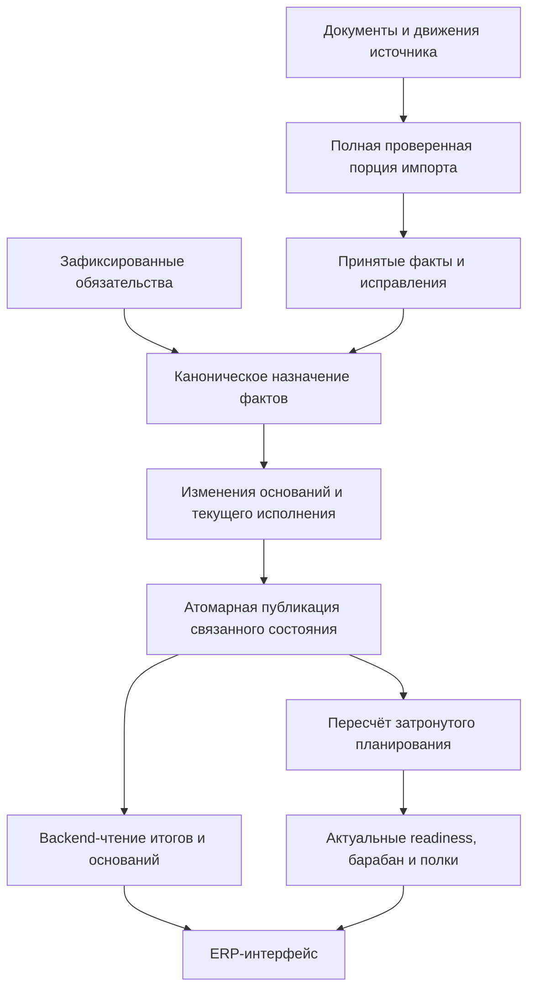

# Roadmap рефакторинга PRODPLAN: движения, основания, текущее исполнение

Дата: 2026-09-11. Ветка: `codex/current-execution-ledger`.

## 1. Назначение и границы

Цель — перевести весь связанный путь от принятого движения 1С до исполнения, планирования и экрана на устойчивые бизнес-сущности и обновляемое текущее состояние. Сохранить доказательства движения и назначения, устранить архив полных расчётных поколений и повторную запись незатронутых данных.

Разработка и проверки выполняются локально. Продовые БД, SSH, OData, воркеры, deploy, push и публикации не входят в текущую работу. Используются синтетические данные и уже доступные локальные материалы. Получение новых данных с прода и будущее развёртывание — отдельные действия после явной команды владельца.

Этот документ задаёт порядок работы. Он не объявляет существующий канон уже заменённым: изменение нормативных требований включено в этап R1. Предметные решения, принятые при реализации, фиксируются в `.docs/notes/mrp-decisions-log.md`; roadmap хранит задачи и статусы, а не вторую копию предметных формул.

Рефакторинг охватывает физику, пополнение, резервы/удержания, выпуск планов, MRP, будущие поставки, custody, барабан/полки, рабочие журналы, API, UI и обменные ссылки. Не включает переписывание всей ERP-оболочки, смену ERP, базу себестоимости чужой системы, новый BOM/FIFO-движок или функциональность, не связанную с этими контурами.

## 2. Целевой результат для пользователя

1. После принятого движения меняются исполнение и остаток затронутых обязательств. На экране можно открыть основания: документ, строку движения, назначенное количество и причину назначения.
2. Повтор синхронизации не меняет цифры, не создаёт новые MRP и не размножает текущие записи.
3. Исправление/отмена движения корректирует соответствующие назначения и зависимый последующий FIFO. Причина изменения видна; исходное движение не теряется.
4. Поступление для пополнения, выпуск плана, расход удержанного материала и закрытие заказа остаются разными событиями. Поступление не закрывает заказ автоматически.
5. Новый физический факт не перезамораживает исходные обязательства и не меняет их идентичность. Смена спецификации создаёт предусмотренную бизнес-версию MRP на остаток того же плана.
6. Экраны показывают согласованное текущее состояние, без тяжёлого реплея на GET и без вычисления предметных итогов в React.
7. При неполном источнике/неготовом расчёте показывается понятная недоступность и ограничиваются зависимые действия; пустота не маскируется под нулевое исполнение.
8. Обслуживание не требует регулярной ручной очистки гигабайтов полных снимков. Рост истории связан с реальными фактами, изменениями назначений и бизнес-решениями.

## 3. Целевая организация хранения

| Сущность | Что сохраняем | Что обновляем | Чего не создаём при обычном обновлении |
|---|---|---|---|
| Движение | Принятые версии, источник, регистратор/строка, замены/отмены | Указатель актуальности принятой версии, прогресс импорта | Копию всей физической истории |
| План и MRP | Исходный выпуск, frozen BOM/потребность, бизнес-версии и причины замены | Явную связь плана с живым MRP | Новый MRP из-за поступления |
| Резерв/обязательство | Устойчивую идентичность, исходные величины и жизненный цикл | Текущее исполнение, связанные подвижные значения | Копии всех retained-резервов |
| Основание исполнения | Движение → получатель → количество/правило; изменения основания с причиной | Текущий набор действующих назначений | Копию неизменных назначений на каждый тик |
| Остаток | Историю физических оснований | Один текущий итог по полному физическому ключу | Generation-scoped StockBin |
| Будущая поставка | Идентичность строки заказа/предложения и нужные бизнес-изменения | Открытое количество, адресные связи, ETA/состояние | Полный снимок всех поставок |
| Custody | Материальные события и происхождение | Текущее состояние и необходимые ограниченные базы восстановления | Бессрочный снимок каждого поколения |
| Очередь/барабан/полки | Команды оператора и причины значимых изменений | Актуальный результат расчёта области ресурса | Архив каждой технической пересборки |
| Интерфейс | Необходимую бизнес-историю, например закрытие плана | Ответ backend из текущих данных | Архив экранных JSON и строк витрин |
| Публикация | Причину, границы источника, статус задачи, версию алгоритма | Небольшой маркер согласованной ревизии | Полный набор таблиц под новым revision |

Сохранённый текущий итог — производное от оснований с одним владельцем записи. Пользователь или второй сервис не редактирует его отдельно от оснований. Тяжёлые результаты планирования допустимо хранить; необязательна история каждой версии такого результата.

Окончательные имена таблиц и ограничения определяются в R1/R3 после инвентаризации. Предпочтение существующим сущностям: StockLedgerEntry, StockLedgerFactSupersession, ReservationEntry, ReservationConsumptionAllocation, AssemblyOutputAllocation. Новая сущность требует объяснения, почему существующая не подходит.

## 4. Целевой путь обработки

Публикация исполнения фиксирует основания, текущие итоги и обработанную границу вместе. Планирование, если оно асинхронно, несёт свою исходную ревизию; неподготовленный результат не выдаётся за актуальный. Локальность определяется зависимостями: общий FIFO-пул затрагивает несколько планов, общая мощность — горизонт соответствующего ресурса. Нельзя обещать, что любое изменение ограничивается одной строкой.

Согласованность PostgreSQL не заменяет проверку полноты OData. Неполный регистратор, изменившаяся версия между страницами или неизвестное происхождение обрабатываются до публикации факта. Повтор после сбоя не должен повторно применять эффект.

## 5. Что уже сделано

| Работа | Состояние | Доказательство и предел |
|---|---|---|
| Отдельная локальная ветка | Готово | Основа `5b7cb973`; исходные незакоммиченные изменения не перенесены |
| Тесты чистого плана изменений | Готово | `91b64946`: 13 числовых сценариев до реализации, начальный красный прогон |
| План изменений через существующий FIFO | Готово | `74c7bcb4`: вставки/изменения/удаления, без записи в БД |
| Проверка чувствительности тестов | Готово | Обнаружены три намеренные ошибки: пропуск обновлений, повторная запись, потеря адресного приоритета |
| Общий pytest кода первого шага | Готово для `74c7bcb4` | 1910 passed, 3 skipped, 35 warnings; не результат будущих коммитов |
| Транзакционное текущее хранение | Не начато | Ни стабильные ID в PostgreSQL, ни конкуренция пока не доказаны |
| API/UI и миграция | Не начато | Рабочие читатели и поколения пока прежние |

Чистая функция пока пересчитывает переданную полную область через существующий allocator и выделяет разницу. Это не инкрементальный импорт и не готовая замена persistence. Подробности первого шага: [тестовый план](current-execution-test-plan.md).

## 6. Последовательность и зависимости

Основной порядок: R1 → R2 → R3 → R4 → R5 → R6 → R7 → R8 → R9 → R10 → R11. R0 обозначает уже сделанную подготовку. R12 — только будущее развёртывание, не разрешённое текущей задачей.

### R1. Контракт данных, границы и предметные решения

**Результат:** однозначно описаны владельцы величин, идентичности и основания; новый контракт не требует полных поколений.

Работы:
- Составить инвентарь каждой таблицы и читателя/писателя generation_id, parent_generation_id, snapshot_id; учитывать FK, JSON, exporter, jobs и прямые SQL.
- Разделить факты, frozen-обязательства, текущие итоги, основания, технические метрики и историю бизнес-команд.
- Определить полные ключи физики и распределения, точность количеств, порядок равных дат и границы исполнения при фиксации/замене MRP.
- Обновить CANON.md, planning-truth-contract.md, frontend-framework.md и решения владельца согласованно с вводимым этапом. Один нормативный источник предметного решения.
- Зафиксировать список допустимых писателей. Выводить из эксплуатации прежние пути вместе с переводом читателей.

**Сначала тесты:** таблица ручных входов/выходов для адресного и FIFO, исправлений, возвратов, закрытия и смены MRP; семантические инварианты отдельно от старых требований хранения.

**Выход:** для любой величины известен единственный владелец; открытые вопросы, влияющие на её реализацию, разрешены; тесты не защищают отменённые снимки под видом бизнес-правила.

### R2. Полностью локальный испытательный контур

**Результат:** воспроизводимые тесты на PostgreSQL с физической изоляцией от прода и 1С.

Работы:
- Отдельная локальная PostgreSQL и тестовая конфигурация с явной идентичностью БД. Сценарий старта не поднимает боевые воркеры.
- Проверить локальность подключения и запрет внешних соединений в интеграционных тестах; никаких production credentials в fixtures.
- Синтетический набор: несколько планов, общие детали/пулы, адресные заказы, агрегированная закупка, последовательные движения, backdate, отмена, rework, материал производства, закрытие.
- Инвентаризировать 3 пропуска общего pytest: необходимые новому контракту проверки не должны оставаться skipped.
- Снять baseline времени, SQL-записей, объёма таблиц и задержек API на фиксированном наборе; сохранить способ воспроизведения.

**Сначала тесты:** guard неверной БД/внешнего адреса, миграция пустой БД, два соединения и контроль rollback.

**Выход:** одна команда поднимает/проверяет локальный контур; сетевой тест не может уйти в прод; baseline воспроизводим.

### R3. Устойчивые идентичности и принятие физики

**Результат:** движение и обязательство не зависят от технического поколения публикации.

Работы:
- Эволюция существующей схемы, migration mapping исторических копий; уникальности по бизнес-идентичности, а не поколению.
- Принятие движения/замены через существующий Ledger и supersession, единственное правило видимости актуальной версии.
- Прогресс импорта и полнота источника отделяются от истории расчётных поколений.
- Явный указатель живого MRP и история его бизнес-замен вместо обхода всех предков для текущего чтения.
- Сохранить происхождение frozen-базиса; текущий свободный остаток не подменяет базис фиксации.

**Сначала тесты:** повтор 100 раз сохраняет ID и число фактов; новая версия создаёт ровно одно исправление; частичный импорт не публикуется; перестановка/пропуск страниц обнаруживается; изменение фактов не переписывает потребности; цепочка предков не требуется для нового текущего чтения.

**Выход:** источник и получатели имеют устойчивые ключи; неверный импорт не меняет принятое состояние. Временный перенос старых ID имеет проверяемую карту, не эвристику «последняя строка».

### R4. Транзакционные основания и текущее исполнение пополнения

**Результат:** первый полный участок «принятый факт → резерв → исполнение → backend-чтение» работает без копии поколения.

Работы:
- В существующем persistence применить план изменений к устойчивым назначениям; изменять только нужные пары факт/получатель.
- Сохранять аудит реальных изменений оснований, не всей матрицы назначений.
- Одной транзакцией фиксировать назначения, исполнение и маркер источника. Защищать область распределения от конкурирующих писателей и применения устаревшего плана.
- Гарантировать явную полноту области до чистого планировщика; пустой набор при сбое запрещён.
- Первоначально один логический писатель; усложнять параллельность только по результатам нагрузки.

**Сначала тесты:** устойчивая запись и ID, нет повторных DML для неизменных назначений, rollback на каждой границе, два реальных конкурирующих импорта, stale revision, атомарное чтение отдельной сессией, неизменность чужого пула, отсутствие новых snapshots/generations.

**Выход:** PostgreSQL-тесты доказывают отсутствие двойного применения и частичного результата. API отдаёт итог и основания одного состояния. Старый и новый писатели не обслуживают один резерв одновременно.

### R5. Исправления, возвраты и зависимый перепроход

**Результат:** изменение прошлого корректно меняет текущее исполнение с объяснением причин.

Работы:
- Нормализовать отмену/замену факта и возвраты существующими каноническими правилами.
- Определять раннюю затронутую границу, общий пул и всех зависимых получателей; перепроход завершается доказанной границей, а не произвольным лимитом строк.
- Обрабатывать адресное поступление, излишек, неизвестный/закрытый резерв, агрегированную закупку и порядок снятия назначений.
- Не переносить прежние назначения на новые обязательства только из-за совпадения детали.

**Сначала тесты:** уменьшение M1 меняет назначение M2; полная отмена, повтор отмены, возврат с точной ссылкой/по строке заказа/без ссылки; backdate до фиксации; разный порядок доставки версий; равные timestamps; десятичные количества; последующий факт на закрытом резерве; метаморфные проверки эквивалентных последовательностей.

**Выход:** для каждого изменённого итога виден набор оснований и причина изменения; исправление не теряется и не разматывается дважды. Сравнение с повторным расчётом использует тот же единственный канонический алгоритм и выполняется в тестах.

### R6. Физические остатки, удержания S0 и материалы производства

**Результат:** компактный текущий склад и custody без размножения StockBin и baseline по каждому тику.

Работы:
- Перевести StockBin на один актуальный итог по полному ключу; сохранить единственного писателя и источник в Ledger.
- Отдельно перенести назначение физического расхода и динамическое удержание старших резервов.
- Перевести custody на события/основания и текущее состояние; определить минимальные базы перепрохода для поздних событий.
- Сохранить отрицательную физику, происхождение корректировок, правила складских пулов/организаций и движения материалов между стадиями.

**Сначала тесты:** поступление не освобождает S0, расход освобождает ровно назначенную величину; минус на складе не превращается в положительный ресурс; backdate, внутреннее перемещение, material return, чужая организация, поздний custody-event за базой; conservation отдельно по каждой роли.

**Выход:** нет второго stock_qty-источника; факты, удержания и custody объясняются; чтение не требует старых полных поколений. Удаление старых baseline разрешается только доказанным контрактом восстановления.

### R7. Выпуск плана, MRP и будущие поставки

**Результат:** планы исполняются и меняют спецификацию как устойчивые бизнес-сущности.

Работы:
- Перенести AssemblyOutputAllocation и текущий выпуск строк плана; сохранить чистый выпуск документа и адресный/FIFO-порядок.
- Сохранить frozen-потребности и закрытие старого MRP при rebase; новый MRP получает сохранённый остаток по предметному контракту.
- Устранить копирование retained-планов/резервов при замене одного MRP.
- ledger_future_supply переводится на устойчивые актуальные строки, связанные с заказами/предложениями; фактическое исполнение не выводится из статуса заказа.
- Разобрать ложные изменения спецификаций: семантика content_hash, детерминированная канонизация, повтор одинакового импорта. Не считать любое изменение хеша автоматически доказанным предметным изменением.

**Сначала тесты:** выпуск после read-back, чистый выпуск/возврат, исходная матрица не меняется; план 10, выпуск 4 → новый MRP на 6 без повторного зачёта 4; чужой план не копируется; одинаковая спецификация не вызывает rebase; повтор команды идемпотентен; положительная/отрицательная коррекция оставшихся заказов по действующим правилам; история закрытия сохраняется.

**Выход:** явный живой run, нет потери накопленного выпуска и переноса старого исполнения новому run; отсутствие поколений не лишает план основания его остатка.

### R8. Очередь, readiness, барабан и полки

**Результат:** один актуальный план выполнения поверх текущих обязательств и исполнения.

Работы:
- Перевести существующие assembly_queue/readiness/drum/shelf persistence на актуальную область расчёта.
- Сохранить pure-ядра и общую очередь всех живых планов; не добавлять отдельную производственную программу.
- Определить invalidation: изменение остатка, обеспечения, спецификации, календаря, мощности, ручной команды.
- Сохранить ручные перемещения/настройки как бизнес-ввод. Не терять их при пересборке.
- Обозначать ревизию источника и готовность результата; worker пересчитывает общую область ресурса там, где это требуется.

**Сначала тесты:** oldest-first, конкуренция двух планов за ресурс, готовность gate, календарная граница/смена даты, перенос невыпущенных плиток, ручной порядок, дефицит полки в пределах MRP, изменение мощности, детерминированность повторного расчёта, запрет действий по stale readiness.

**Выход:** текущий график не требует архива старых витрин; повтор без изменений не размножает строки; одна величина не считается независимым движком в нескольких контурах.

### R9. Журналы, API, UI и обменные связи

**Результат:** все пользовательские пути читают целевую модель, сохраняют действия и объяснения.

Работы:
- Последовательно перевести production_control, purchase_control, period_plan_execution, mrp_result и assembly_queue с исторических экранных снимков на backend-чтение текущего состояния.
- Согласованные DTO, разрешённые действия и итоги формируются backend; OpenAPI → транспортные типы → существующие frontend services.
- Вывести на экран основания исполнения и сведения о неготовности; сохранить навигацию и пользовательские настройки общего ERP shell.
- Перенести ссылки purchase_export, production_products/material_issues, sync_link и иных идемпотентных действий на устойчивые сущности.
- Сохранить команды «Произвести», read-back, закрытие только оператором и независимость факта от статуса заказа.

**Сначала тесты:** contract API, отсутствие DML и тяжёлого реплея на GET, параллельная публикация, недоступность источника; Playwright: план → MRP → журнал → основание → очередь; локальный fake 1С для повторного экспорта и read-back; нет второй отправки после сбоя; frontend build.

**Выход:** каждый затронутый экран и команда используют одну модель исполнения; нет fallback к историческому снимку. Экспортные тесты не вызывают настоящую 1С.

### R10. Миграция и поэтапное удаление старого контура

**Результат:** проверенный bootstrap current owner без исторического WAL-взрыва;
удаление полных поколений выполняется отдельной будущей GC-волной после
cutover зависимых projections.

Работы:
- Rehearsal миграции на локальном наборе с историческими копиями, бизнес-заменами, закрытыми планами и экспортными связями.
- Сформировать preflight и детальный манифест: какие данные сохраняются/переносятся/удаляются, сколько строк и почему, какие зависимости неизвестны.
- Проверить старые ID → устойчивые ID, FK и JSON-ссылки, source supersession, frozen-базисы, историю закрытий и основания внешних действий.
- Зафиксировать границы остановки писателей, применить bootstrap-миграцию только к exact accepted pointer, проверить postflight; повтор запуска должен быть предсказуемым.
- Не выполнять в bootstrap-миграции исторический rebind/delete/archive: старые rows остаются `legacy` и недоступны runtime. Удаление generation-fork/carry/snapshot paths и compact GC archive — отдельная будущая волна с доказанными зависимостями.
- После `20260914_01` bounded `20260914_02` сохраняет compatibility owner только для exact accepted generation и active BUILDING staging. После успешной публикации current execution старые non-building projection copies удаляются set-based в FK-safe порядке; `ledger_generation` и reservation/history GC в этой волне не выполняются.
- `20260914_02` разрешает необратимое удаление только при операторском PostgreSQL session guard `prodplan.execution_projection_backup_ready=on`; one-off R10 apply сначала публикует полный execution contour (assembly/readiness/drum включая excluded и shelf), затем obligation scopes и postflight проверяет все семь execution manifests.
- Accepted-generation GC/reclaim остаётся отдельным пунктом 4: `tools/accepted_generation_gc.py` сначала создаёт read-only manifest с exact candidate IDs и FK blockers, затем guarded local apply архивирует reservation events и удаляет только proven historical rows. Physical `pg_repack`/`VACUUM FULL` выполняются только отдельной explicit phase.
- Отдельно репетировать возврат места и восстановление из контрольной копии; DELETE не считается доказательством уменьшения файла БД.
- Локальный storage rehearsal `tools/r10_storage_rehearsal.py` создаёт только
  disposable schema, проверяет custom-format dump/restore, SHA-256, stable IDs
  и физический `pg_total_relation_size` reclaim после DROP.

**Сначала тесты:** миграция с дубликатами, частичный сбой, повтор, неизвестная ссылка, отсутствие произвольного выбора «последнего»; до/после по предметным значениям; повтор внешней команды; восстановление контрольной копии и проверка её пригодности.

**Выход:** нет потерянных оснований и неоднозначных ссылок; нет runtime-зависимости текущего чтения от цепочки поколений; удаляемые таблицы не используются кодом/SQL/jobs. Неизвестная зависимость останавливает миграцию.

### R11. Полная локальная приёмка и пакет готовности

**Результат:** готовый к рассмотрению релиз, всё ещё без изменения прода.

Работы:
- Полный pytest с финального коммита, PostgreSQL integration/concurrency, migration rehearsal, build/lint/smoke по затронутому frontend.
- Проверки генеративных последовательностей движений/исправлений, mutation probes критических правил, fault injection и восстановление.
- Длительный локальный прогон повторов/изменений с измерением роста рабочих таблиц, WAL, dead tuples, latency и отставания обработки.
- Сопоставить с baseline R2; утвердить численные бюджеты до оптимизаций, не подгонять пороги под достигнутый результат.
- Составить список остаточных рисков и неподдержанных случаев. Любой критичный пропуск блокирует статус «готово».

**Выход:** выполнена общая приёмочная матрица ниже, сохранены команды/логи/commit/environment. Один сводный release report содержит доказательства, миграцию и эксплуатационный сценарий.

### R12. Возможное будущее развёртывание — только отдельной командой

На этом этапе roadmap сейчас заканчивается подготовкой. После явной команды владельца потребуется заново проверить live-версию и drift, получить проверенную контрольную копию, остановить писателей в согласованное окно, мигрировать, выполнить read-only сверку, затем разрешить единственного писателя и проверить команды.

Возврат старой БД безопасен только до новых внешних действий. После отправки документов в 1С восстановление старой копии может потерять сведения об уже выполненных действиях и вызвать повторную отправку. Тогда сначала фиксируются внешние результаты и выполняется сверка/исправление; «просто восстановить dump» не является универсальным rollback.

Отсутствие команды на R12 не блокирует R1–R11 и не требует повторных разрешений на обычную локальную работу.

## 7. Протокол тестов для каждой волны

1. До реализации записать предметный пример: входы, последовательность действий, ожидаемые количества, основания и что не должно измениться.
2. Коммит тестов/fixtures отдельно; ожидания задаются вручную или независимыми законами сохранения, не результатом проверяемого метода.
3. Снять красный прогон по правильной причине. Missing-symbol допустим на старте нового API, но недостаточен как доказательство полезности теста.
4. Реализовать минимальный участок в каноническом владельце. Не исправлять неудобные ожидания ради зелёного прогона.
5. Если обнаружено ошибочное предметное ожидание, отдельный коммит с объяснением/источником решения; при неоднозначности — вопрос владельцу до зависимой реализации.
6. Проверить чувствительность: намеренно нарушить адресный приоритет, идемпотентность, atomicity либо другое защищаемое свойство. Тест обязан обнаружить нарушение.
7. Выполнить соответствующие unit, PostgreSQL integration, API и UI проверки; затем полный обязательный gate финального коммита волны.
8. Зафиксировать результат, остаточные проверки и удалённые старые пути. Зелёный unit-тест не заменяет PostgreSQL-concurrency или миграционный тест.

Тесты старой реализации разделяются на предметные и структурные. Предметные сохраняются; утверждения «создан новый snapshot/generation» заменяются после изменения контракта. Массово удалять красные старые тесты нельзя.

## 8. Общая приёмочная матрица

| Код | Проверяемый результат | Доказательство |
|---|---|---|
| A01 | Повтор одного импорта 100 раз не изменяет исполнение/ID и не размножает назначения | PostgreSQL counts, IDs и DML instrumentation |
| A02 | Адресный факт + FIFO-излишек учитываются количественно один раз внутри роли | Ручные сценарии + conservation |
| A03 | Исправление прошлого корректирует последующие основания | Последовательности M1/M2/return/backdate с точным expected |
| A04 | Frozen-обязательства и исходный выпуск не переписываются фактами | До/после по всем неизменным полям |
| A05 | Смена MRP не переносит старое исполнение и не копирует чужие планы | Сценарий 10 → выпуск 4 → новый MRP на 6 |
| A06 | Факт, назначения, итог и прогресс импорта атомарны | Fault injection и независимый читатель |
| A07 | Конкурирующие импорты не дают двойного зачёта | Две PostgreSQL-сессии и воспроизводимый interleaving |
| A08 | Неизвестный/неполный источник не становится нулём | Fail-closed service/API tests |
| A09 | Остаток, удержание и пополнение имеют разные основания | Поступление/расход/перемещение и S0 |
| A10 | Поздний custody-факт и коррекция закрытого плана обработаны явно | Утверждённые предметные сценарии, без silent skip |
| A11 | Барабан сохраняет очередь, ограничения ресурса и ручной ввод | Детерминированные календарные сценарии |
| A12 | API/UI читают согласованный текущий результат | Contract + concurrent read + Playwright |
| A13 | Экспорт и read-back идемпотентны после миграции | Fake 1С, разрыв до/после ответа, перенос ссылок |
| A14 | No-op обновления не дают линейного роста текущих таблиц | Длительный прогон, counts и размер отдельно от аудита |
| A15 | Новое изменение не копирует незатронутые обязательства | Changed-row manifest и проверка ID |
| A16 | Нет старых runtime-читателей/писателей поколений | Инвентарь кода, SQL, задач и schema dependencies |
| A17 | Миграция/восстановление воспроизводимы | Два локальных rehearsal с одинаковыми исходными данными |
| A18 | Результат не хуже заранее согласованных бюджетов | Benchmark на фиксированных seed/объёмах |

## 9. Измерения и политика хранения

Бюджеты p95 API, времени принятие → исполнение, времени коррекции прошлого, длительности общего планирования и окна миграции определяются по baseline R2 и потребностям оператора. Числа фиксируются до оптимизаций. Сейчас нет основания обещать конкретные миллисекунды, размер конечной БД или календарный срок всей работы.

Уже фиксированные структурные требования: один активный MRP на план; ноль новых поколений/экранных архивов от no-op тика целевого пути; ноль повторных назначений от повторного принятого факта; отсутствие копий чужих обязательств. Физические bytes могут колебаться из-за WAL/MVCC/autovacuum, поэтому счётчики строк и действительных изменений измеряются отдельно от файлового размера.

История движений, исправлений и бизнес-решений сохраняется. Журнал изменения назначения растёт только при реальном изменении основания. Машиночитаемая политика `config-test/r11_retention_policy.json` разделяет три класса: предметный/audit журнал сохраняется на business/legal horizon; technical task/debug записи — 30 дней после terminal incident closure; migration control copies — 90 дней после owner sign-off и verified restore read-back. Для всех трёх классов automatic deletion запрещён: удаление возможно только после указанного условия и явного решения владельца. Контрольные копии миграции имеют отдельное назначение и срок, не подменяют runtime-историю. Возможность отчёта «как было известно тогда» требует сохранения версий оснований/правил, а не обещания восстановить прошлое по одним сегодняшним итогам.

## 10. Открытые решения и риски

| Вопрос | Предлагаемое направление | Когда требуется окончательное решение |
|---|---|---|
| Коррекция факта после закрытия плана | Сохранять факт и бизнес-закрытие; отдельно отражать корректировку, без автоматического переоткрытия | R1, до тестов R5/R7 для закрытого плана |
| Исторический режим отчёта | Решено в R1: сохранять `posting_at` и `known_at`, режим выбирать явно | Выполнено в R1; детали в decisions log §32 |
| Область FIFO при backdate и смене обязательств | Полный зависимый участок с учётом истории жизненного цикла | R1/R5 |
| Независимость пула и физического ключа | Сохранить предметные правила, не объявлять склад границей всех расчётов | R1/R3 |
| Допустимое отставание readiness/барабана | Отдельная ревизия готовности и запрет зависимых действий | R2/R8 |
| Источник ложных ревизий спецификаций | Сравнивать смысл payload, а не только количество хешей | R7 |
| Миграционные копии без однозначного соответствия | Остановка preflight с диагностикой, не произвольный выбор строки | R10 |
| Новые изменения основной ветки во время работы | Периодическая явная сверка, тематическое перенесение, повтор gate | Перед каждой крупной волной и R11 |

Открытое решение блокирует только зависимую часть, а не независимую локальную подготовку. Снижение размера хранения само по себе не доказывает исправление всех расчётов; каждая предметная ошибка получает отдельный воспроизводимый пример.

## 11. Правило ведения работы

Для каждой R-волны в release report записываются: статус, test-first commit, implementation commit, использованные fixtures, команды и результаты, удалённые прежние пути, оставшиеся риски. Статусы: не начато / тесты зафиксированы / реализация / проверка / принято локально. Статус «принято локально» допустим только после её выходного gate.

## 12. R11 — финальная локальная приёмка

R11 принято локально после test-first generative/mutation/fault/no-op soak,
двух одинаковых disposable-schema migration/storage rehearsals, реального
R2 TestClient API p95, current-publish budgets, frontend build/lint/unit and
Playwright smoke, PostgreSQL concurrency/migration/restore gates и полного
локального Python gate. Машиночитаемая матрица
`config-test/r11_acceptance_budgets.json` хранит A01–A18 со статусом `covered`
и конкретными nodes; финальный evidence validator не разрешает unsupported
`passed`, отсутствующие records или нечисловые/нефинитные budget metrics.

R1–R11 локально завершены: целевая current-only модель, удаление старого
runtime/storage контура, миграция, restore/reclaim и UI/API evidence записаны
в release report. Это не разрешение production, SSH, OData, 1C, workers,
deploy или push. R12 не начата и требует отдельной явной команды владельца.
